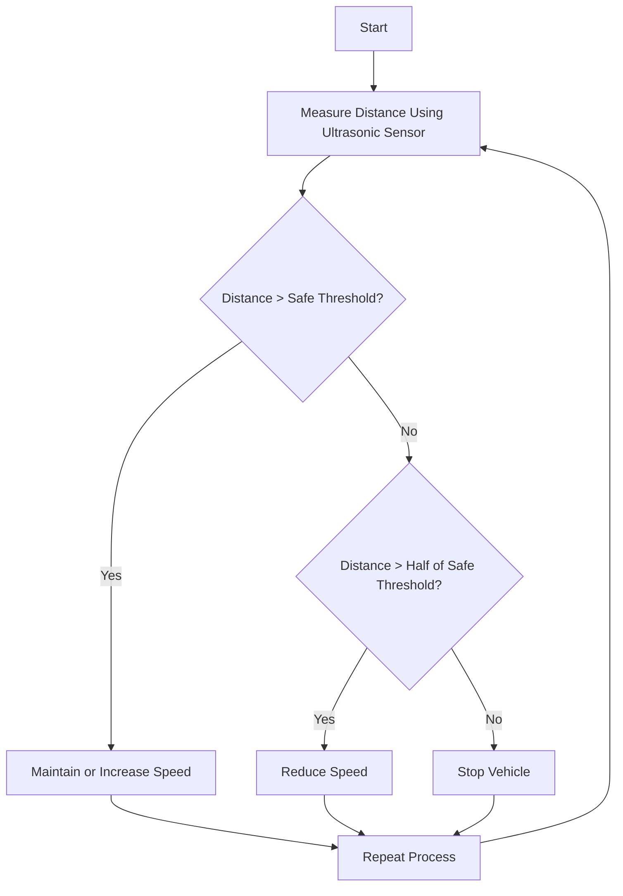

# APAAS
- [[01 Projects/01 Electronics/AI Powered Accident Avoidance System/Versions|Versions]]
>[!SUMMARY|right] Table of Contents
>- [[AI Powered Accident Avoidance System#APAAS|APAAS]]
>    - [[AI Powered Accident Avoidance System#Components|Components]]
>            - [[AI Powered Accident Avoidance System#19-03-25|19-03-25]]
>        - [[AI Powered Accident Avoidance System#**Actuall Sele**|**Actuall Sele**]]
>    - [[AI Powered Accident Avoidance System#Case Study|Case Study]]
>        - [[AI Powered Accident Avoidance System#Problem Statement|Problem Statement]]
>        - [[AI Powered Accident Avoidance System#Initial Solution|Initial Solution]]
>            - [[AI Powered Accident Avoidance System#Initial Solution Implementation|Initial Solution Implementation]]
>- [[AI Powered Accident Avoidance System#Coding|Coding]]
>    - [[AI Powered Accident Avoidance System#Install the Libs|Install the Libs]]
>    - [[AI Powered Accident Avoidance System#Pi to ESP i2c |Pi to ESP i2c ]]
>        - [[AI Powered Accident Avoidance System#PI Code |PI Code ]]
>        - [[AI Powered Accident Avoidance System#Using YOLO|Using YOLO]]
>- [[AI Powered Accident Avoidance System#Load the YOLOv8 model from the provided path|Load the YOLOv8 model from the provided path]]
>- [[AI Powered Accident Avoidance System#Function to perform object detection on a frame|Function to perform object detection on a frame]]
>- [[AI Powered Accident Avoidance System#Start video capture from USB camera|Start video capture from USB camera]]
>- [[AI Powered Accident Avoidance System#Release the video capture and close the window|Release the video capture and close the window]]
>- [[AI Powered Accident Avoidance System#Load the YOLO11 model|Load the YOLO11 model]]
>- [[AI Powered Accident Avoidance System#model = YOLO(r"C:\Users\FEBY DAS K Y\Desktop\working models\best.pt")|model = YOLO(r"C:\Users\FEBY DAS K Y\Desktop\working models\best.pt")]]
>- [[AI Powered Accident Avoidance System#Export the model to ONNX format|Export the model to ONNX format]]
>- [[AI Powered Accident Avoidance System#Load the exported ONNX model|Load the exported ONNX model]]
>        - [[AI Powered Accident Avoidance System#Microcontroller Code |Microcontroller Code ]]
>            - [[AI Powered Accident Avoidance System#Lane Departure Warning|Lane Departure Warning]]

```

raspberry pi:
  username: pi
  password: pi
  wifi:
    essid: pi_wifi
    password: 12345678

```

## Components

**Initial selection**

| Components                                   | Qty | Cost        |
| -------------------------------------------- | --- | ----------- |
| [Raspberry Pi 5](https://amzn.in/d/30wDSem)  | 1   | 8250/-      |
| [Pi Cam](https://amzn.in/d/gbrcEMg)          | 1   | 361/-       |
| 18650 Battery 3.7V                           | 4   | 210/-       |
| [Car Chassis](https://amzn.in/d/c0FgwMO)     | 1   | 678/-       |
| [Boost Converter](https://amzn.in/d/dno182p) | 1   | 296/-       |
| Miscellaneous                                |     | 300/-       |
| Total                                        | -   | 10095/-<br> |

#### 19-03-25

| Components      | Cost |
| --------------- | ---- |
| 3xBattery case  |      |
| Boost Converter | 90/- |
|                 |      |

### **Actuall Sele**

| Sl No. | Component                                                          | Cost      |
| ------ | ------------------------------------------------------------------ | --------- |
| 1      | [L298 Motor Driver](https://amzn.in/d/70eW6LH)                     | ₹ 189/-   |
| 2      | [CP PLUS 64GB microSDXC](https://amzn.in/d/40ZthjA)                | ₹ 549/-   |
| 3      | [Raspberry Pi 5 8GB RAM](https://amzn.in/d/3ER0EV6)                | ₹ 8,135/- |
| 4      | [4-wheel Drive Robot Smart Car Chassis](https://amzn.in/d/aAF5WfR) | ₹ 675/-   |
| 5      | [Raspberry Pi 5Mp](https://amzn.in/d/dqulLAa)                      | ₹ 380/-   |

## Case Study

### Problem Statement

Accidents involving vehicles often occur due to blind spots, lack of pedestrian awareness, and insufficient real-time feedback for drivers. This poses a significant risk to both pedestrians and drivers.

### Initial Solution

==Attach a camera to the car's bonnet== equipped with AI-powered image recognition and real-time processing. This system can ==detect pedestrians, cyclists, and obstacles,== alerting the driver with audible and visual signals. It can also integrate advanced security features such as ==automatic braking, lane departure warnings, and adaptive cruise control==, ensuring pedestrian safety and reducing the likelihood of accidents.

2. Collision Avoidance (CA)
3. AI-based driving assistance system (AI-DAS)
4. Raspberry Pi; OpenCV
5. safety message dissemination
6. multihop broadcast protocol for dissemination^[the action or fact of spreading something] of time-critical emergency messages (EMs) in vehicular ad hoc networks (VANETs)^[https://ieeexplore.ieee.org/document/6675860]
7.  medium access control (MAC)(check this out with the article)

#### Initial Solution Implementation
1. For adaptive cruise control , we have used an [[Interfacing#Ultrasonic Sensor Interfacing|Ultasonic Sensor]]  , to measure the distance to the vehicle ahead. And stop acording to the conditions



# Coding
## Install the Libs

```bash
pip install ultralytics

```

_note that after some time i have to reinstall ultralytics_

## Pi to ESP i2c 

```c
// source : https://dronebotworkshop.com/i2c-arduino-raspberry-pi/ 
const int ledPin = 13; 
 
void setup() {
  Wire.begin(0x8);
  
  // Call receiveEvent when data received                
  Wire.onReceive(receiveEvent);
  
  // Setup pin 13 as output and turn LED off
  pinMode(ledPin, OUTPUT);
  digitalWrite(ledPin, LOW);
}
 
// Function that executes whenever data is received from master
void receiveEvent(int howMany) {
  while (Wire.available()) { // loop through all but the last
    char c = Wire.read(); // receive byte as a character
    digitalWrite(ledPin, c);
  }
}
void loop() {
  delay(100);
}

```

### PI Code 

**Sources** : https://www.instructables.com/Autonomous-Lane-Keeping-Car-Using-Raspberry-Pi-and/

```python
import cv2

video = cv2.VideoCapture(0)

while True:
  ret,frame = video.read()
  frame = cv2.flip(frame,-1) # used to flip the image vertically
  cv2.imshow('original',frame)
  cv2.imwrite('original.jpg',frame)

  key = cv2.waitKey(1)
  if key == 27:
     break

video.release()
cv2.destroyAllWindows()

```

<details> <summmary></summary> </details>

### Using YOLO

- Trainer Kit

```python
from multiprocessing import freeze_support
from ultralytics import YOLO
def main():
    # Load the YOLOv5n model (small version of YOLOv5)
    model = YOLO("yolov5nu.pt")  # Use YOLOv5n model

    # Train the model using the custom dataset
    model.train(
        data="./datasets/data.yaml",  # Path to your dataset YAML file
        epochs=1,  # Number of training epochs (adjust as needed)
        imgsz=640,  # Input image size (adjust based on your dataset)
        batch=8,  # Batch size for training (adjust if needed)
        name="model",  # Name of the experiment/logs folder
        device="cpu",  # Use 'cpu' if no GPU is available (for Raspberry Pi)
        workers=4,  # Adjust based on your system's capabilities
    )

if __name__ == "__main__":
    freeze_support()  # For Windows-based systems, ensuring proper multiprocessing
    main()

```

- Model run

```python
import cv2
import numpy as np
from ultralytics import YOLO
import time

# Load the YOLOv8 model from the provided path
model = YOLO('/home/pi/best.onnx', task='detect')

# Function to perform object detection on a frame
def detect_objects(frame):
    results = model(frame)
    annotated_frame = results[0].plot()  # Get the annotated frame with bounding boxes and labels
    return annotated_frame

# Start video capture from USB camera
video_capture = cv2.VideoCapture(0)

if not video_capture.isOpened():
    print("Error: Could not open video.")
    exit()

while True:
    ret, frame = video_capture.read()
    if not ret:
        print("Error: Could not read frame.")
        break

    # Perform object detection on the frame
    detected_frame = detect_objects(frame)

    # Display the detected frame
    cv2.imshow("Detected PPE Objects", detected_frame)

    # Add a sleep time to manage frame rate
    time.sleep(0.03)  # Adjust to control the speed

    # Exit the loop if the user presses the 'q' key
    if cv2.waitKey(1) & 0xFF == ord('q'):
        break

# Release the video capture and close the window
video_capture.release()
cv2.destroyAllWindows()

```

- Convert.py

```python
from ultralytics import YOLO

# Load the YOLO11 model
# model = YOLO(r"C:\Users\FEBY DAS K Y\Desktop\working models\best.pt")
model = YOLO(r"./yolov5nu.pt")

# Export the model to ONNX format
model.export(format="onnx")  # creates 'yolo11n.onnx'

# Load the exported ONNX model
onnx_model = YOLO("fireppe.onnx")

```

### Microcontroller Code 

#### Lane Departure Warning
- It uses ir sensor 

```c
#include "ir_sensor.h"
#include <Arduino.h>
IR_Sensor::IR_Sensor(uint8_t pin) {
	_pin = pin;
	pinMode(_pin, INPUT);
}
bool IR_Sensor::is_lane() {
	return digitalRead(_pin);
}

```