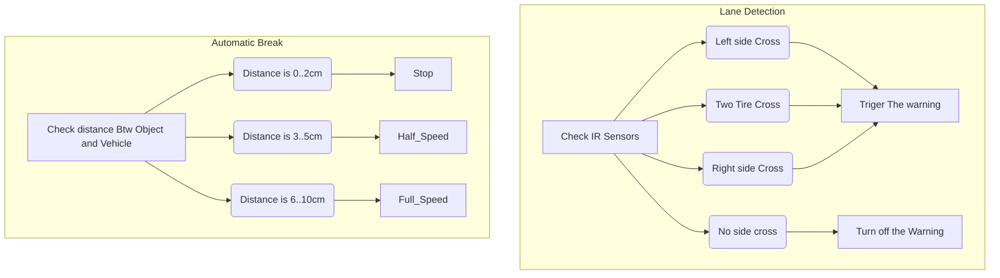

# Using ESP32
## V1
![[img_aibaas_car.jpg|400x500]]

```c
// Pin definitions under ESP32
#define IN1 27
#define IN2 26
#define IN3 25
#define IN4 33
#define ULTRASONIC_PIN 18
#define LEFT_IR_PIN 34
#define RIGHT_IR_PIN 35
#define PWM_PIN 14
#define PWM_PIN_2 12
#define LANE_DETECT_LED_PIN 22
#define EMERGENCY_STOP_LED_PIN 21

```

![[Drawing 2025-03-26 09.59.02.excalidraw|800x500]]

