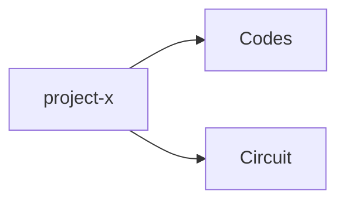

# Version Control

### Base Repo 
- [Kannur-Solar-Battery-Monitoring-System](https://github.com/aruncs31s/Kannur-Solar-Battery-Monitoring-System)

Base repo should contain the documentation and different catogories included in this project as directories

for example, If i have `project-x` and it has coding part and circuit design part , then we it should be like follows

So the main repo contains all the supporting documentation and credits 