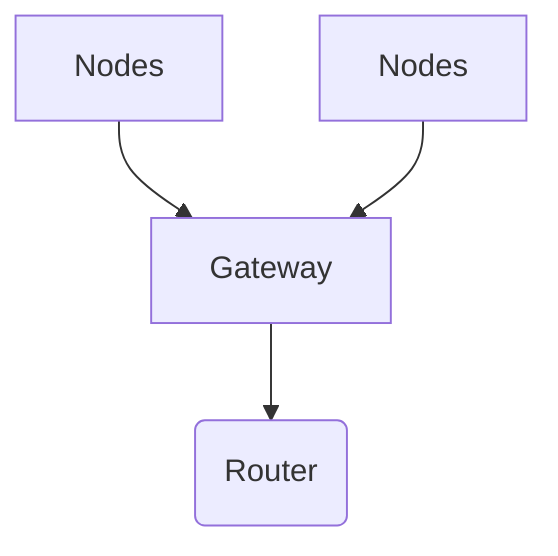

# Node to Node Communication
>[!SUMMARY]- Table of Contents
>- [[Node to Node Communication#Node to Node Communication|Node to Node Communication]]
>                - [[Node to Node Communication#Light Sensor|Light Sensor]]
>                - [[Node to Node Communication#Wind Direction|Wind Direction]]
>                - [[Node to Node Communication#Temp and Humidity Sensor|Temp and Humidity Sensor]]
>        - [[Node to Node Communication#ESP32 Programming|ESP32 Programming]]
>            - [[Node to Node Communication#Pins Used|Pins Used]]
>                - [[Node to Node Communication#Single Node Receiver Side|Single Node Receiver Side]]
>                - [[Node to Node Communication#Single Node Sender Side|Single Node Sender Side]]
>            - [[Node to Node Communication#Using Meany to One|Using Meany to One]]
>                - [[Node to Node Communication#Receiver Side|Receiver Side]]
>                - [[Node to Node Communication#Sender Side|Sender Side]]
>        - [[Node to Node Communication#Connecting to the Router|Connecting to the Router]]
>        - [[Node to Node Communication#Dashboard|Dashboard]]
>            - [[Node to Node Communication#Using LittleFS|Using LittleFS]]
>    - [[Node to Node Communication#Resources|Resources]]

## **Objective** :

> To make all the node to communicate with the gateway(receiver)

## **Methodology**:

> - Going to use [[ESP_NOW]]
> - There Will Be 5 Nodes
> - Going to use [[08 Electronics/Embedded Systems/Micro Controllers/Espressif/ESP32/ESP32|ESP32]]

## **Sensors**

### 1. Light Intensity Sensor 
![[Interfacing#VEML7700 Light Sensor]]

### 2. Wind Direction
[Source](file:///home/aruncs/Documents/ESP%20Mesh/Weather_Meter_Kit_Datasheet.pdf)

- A voltage must be supplied to each instrument to produce an output.

- we can use interrupt programming for this
- ==Green== Wind Direction and black

![[wind_station.excalidraw|1000x300]]

  Expected Values

```c
#define SFE_WMK_ADC_ANGLE_0_0 3118
#define SFE_WMK_ADC_ANGLE_22_5 1526
#define SFE_WMK_ADC_ANGLE_45_0 1761
#define SFE_WMK_ADC_ANGLE_67_5 199
#define SFE_WMK_ADC_ANGLE_90_0 237
#define SFE_WMK_ADC_ANGLE_112_5 123
#define SFE_WMK_ADC_ANGLE_135_0 613
#define SFE_WMK_ADC_ANGLE_157_5 371
#define SFE_WMK_ADC_ANGLE_180_0 1040
#define SFE_WMK_ADC_ANGLE_202_5 859
#define SFE_WMK_ADC_ANGLE_225_0 2451
#define SFE_WMK_ADC_ANGLE_247_5 2329
#define SFE_WMK_ADC_ANGLE_270_0 3984
#define SFE_WMK_ADC_ANGLE_292_5 3290
#define SFE_WMK_ADC_ANGLE_315_0 3616
#define SFE_WMK_ADC_ANGLE_337_5 2755

```

Obtained Values

```c
3938
3950
3941
3951
3943
3939
4095
4095
4095
4095
4095
4095
4095
3945
3948

```

### 3. Temp and Humidity Sensor

Name: 7semi SHT40 Humidity and Temperature Sensor Probe I2C

| Operating Voltage:<br> | 3.3V<br>     |
| ---------------------- | ------------ |
| Interface:             | I2C          |
| Temperature Range:     | -40 to 125 C |
| Humidity Range:        | 0~100%rh     |
| VCC                    | Red          |
| Black                  | GND          |
| Yellow                 | SDA          |
| Green                  | SCL          |

## ESP32 Programming

#### Pins Used

| Sensor           | Pin            | ESP32 GPIO |
| ---------------- | -------------- | ---------- |
| VEML7700         | SDA            | 21         |
|                  | SCL            | 22         |
| Wind Speed Meter | Intterrupt PIN | 13         |
|                  |                |            |

- Single Node
  - [[#Single Node Sender Side]]
  - [[#Single Node Receiver Side]]
- Multi Node

##### Single Node Receiver Side

```c
#include <esp_now.h>
#include <WiFi.h>

// Replace it with Router IP
const char* ssid = "ssid";
const char* password = "passwd";

// Structure example to receive data
// Must match the sender structure
typedef struct Data {
char a[32];
int b;
} Data;
Data received_data;

// callback function that will be executed when data is received
void OnDataRecv(const uint8_t * mac, const uint8_t *incomingData, int len) {
// Copy the value from source to destination
memcpy(&received_data, incomingData, sizeof(received_data));
Serial.print("Bytes received: ");
Serial.println(len);
Serial.print("Char: ");
Serial.println(received_data.a);
Serial.print("Int: ");
Serial.println(received_data.b);
Serial.println();
}

void setup() {
Serial.begin(9600);
// Set device as a Wi-Fi Station
WiFi.mode(WIFI_STA);

// Init ESP-NOW
if (esp_now_init() != ESP_OK) {
Serial.println("Error initializing ESP-NOW");
return;
}
// FIX: Implement Reconnection
WiFi.begin(ssid,password);
while (WiFi.status() != WL_CONNECTED) {
delay(500);
Serial.print(".");
}
esp_now_register_recv_cb(esp_now_recv_cb_t(OnDataRecv));

}
void loop() {
Serial.println("IP address: ");
Serial.println(WiFi.localIP());
delay(1000);
}

```

##### Single Node Sender Side

You can use [[08 Electronics/Embedded Systems/Micro Controllers/Espressif/ESP32 1/programming/WiFi Programming#Get MAC Address|Get Mac]] to get mac address

```c
#include <esp_now.h>
#include <WiFi.h>

// Receiver
uint8_t broadcastAddress[] = {0x08, 0xD1, 0xF9, 0xED, 0x30, 0xD8};

// Structure example to send data
// Must match the receiver structure
typedef struct struct_message {
  char a[32];
  int b;
  float c;
  bool d;
} struct_message;

// Create a struct_message called myData
struct_message myData;

esp_now_peer_info_t peerInfo;

// callback when data is sent
void OnDataSent(const uint8_t *mac_addr, esp_now_send_status_t status) {
  Serial.print("\r\nLast Packet Send Status:\t");
  Serial.println(status == ESP_NOW_SEND_SUCCESS ? "Delivery Success" : "Delivery Fail");
}

void setup() {
  // Init Serial Monitor
  Serial.begin(9600);

  // Set device as a Wi-Fi Station
  WiFi.mode(WIFI_STA);

  // Init ESP-NOW
  if (esp_now_init() != ESP_OK) {
    Serial.println("Error initializing ESP-NOW");
    return;
  }

  // Once ESPNow is successfully Init, we will register for Send CB to
  // get the status of Trasnmitted packet
  esp_now_register_send_cb(OnDataSent);

  // Register peer
  memcpy(peerInfo.peer_addr, broadcastAddress, 6);
  peerInfo.channel = 0;
  peerInfo.encrypt = false;

  // Add peer
  if (esp_now_add_peer(&peerInfo) != ESP_OK){
    Serial.println("Failed to add peer");
    return;
  }
}

void loop() {
  // Set values to send
  strcpy(myData.a, "THIS IS A CHAR");
  myData.b = random(1,20);
  myData.c = 1.2;
  myData.d = false;

  // Send message via ESP-NOW
  esp_err_t result = esp_now_send(broadcastAddress, (uint8_t *) &myData, sizeof(myData));

  if (result == ESP_OK) {
    Serial.println("Sent with success");
  }
  else {
    Serial.println("Error sending the data");
  }
  delay(2000);
}

```

#### Using Meany to One

##### Receiver Side

```c
#include <esp_now.h>
#include <WiFi.h>

// Structure example to receive data
// Must match the sender structure
typedef struct struct_message {
  int id;
  int x;
  int y;
}struct_message;

// Create a struct_message called myData
struct_message myData;

// Create a structure to hold the readings from each board
struct_message board1;
struct_message board2;
struct_message board3;

// Create an array with all the structures
struct_message boardsStruct[3] = {board1, board2, board3};

// callback function that will be executed when data is received
void OnDataRecv(const uint8_t * mac_addr, const uint8_t *incomingData, int len) {
  char macStr[18];
  Serial.print("Packet received from: ");
  snprintf(macStr, sizeof(macStr), "%02x:%02x:%02x:%02x:%02x:%02x",
           mac_addr[0], mac_addr[1], mac_addr[2], mac_addr[3], mac_addr[4], mac_addr[5]);
  Serial.println(macStr);
  memcpy(&myData, incomingData, sizeof(myData));
  Serial.printf("Board ID %u: %u bytes\n", myData.id, len);
  // Update the structures with the new incoming data
  boardsStruct[myData.id-1].x = myData.x;
  boardsStruct[myData.id-1].y = myData.y;
  Serial.printf("x value: %d \n", boardsStruct[myData.id-1].x);
  Serial.printf("y value: %d \n", boardsStruct[myData.id-1].y);
  Serial.println();
}

void setup() {
  //Initialize Serial Monitor
  Serial.begin(9600);

  //Set device as a Wi-Fi Station
  WiFi.mode(WIFI_STA);

  //Init ESP-NOW
  if (esp_now_init() != ESP_OK) {
    Serial.println("Error initializing ESP-NOW");
    return;
  }

  // Once ESPNow is successfully Init, we will register for recv CB to
  // get recv packer info
  esp_now_register_recv_cb(esp_now_recv_cb_t(OnDataRecv));
}

void loop() {
  // Acess the variables for each board
  /*int board1X = boardsStruct[0].x;
  int board1Y = boardsStruct[0].y;
  int board2X = boardsStruct[1].x;
  int board2Y = boardsStruct[1].y;
  int board3X = boardsStruct[2].x;
  int board3Y = boardsStruct[2].y;*/

  delay(10000);
}

```

##### Sender Side

```c
// /*
// * Author : Arun CS
// * Github : https://github.com/aruncs31/
// * URL :
// https://github.com/aruncs31s/ESP32_MeshNet_For_Node_To_Gateway_Communication
// sources : https://randomnerdtutorials.com/esp-now-esp32-arduino-ide/

//  */
// #include <WiFi.h>
// #include <esp_now.h>

// // Receiver in this case the gateway

// uint8_t broadcastAddress[] = {0x08, 0xD1, 0xF9, 0xED, 0x30, 0xD8};

// // Structure example to send data
// // Must match the receiver structure
// typedef struct Data {
//   uint8_t board_id;// change it accordingly
//   char a[30];
//   int b;
//   float c;
//   bool d;
// } Data;

// Data sender_data;

// esp_now_peer_info_t peerInfo;

// // callback when data is sent
// void OnDataSent(const uint8_t *mac_addr, esp_now_send_status_t status) {
//   Serial.print("\r\nLast Packet Send Status:\t");
//   Serial.println(status == ESP_NOW_SEND_SUCCESS ? "Delivery Success"
//                                                 : "Delivery Fail");
// }

// void setup() {
//   // Init Serial Monitor
//   Serial.begin(9600);
//   sender_data.board_id=1;
//   // Set device as a Wi-Fi Station
//   WiFi.mode(WIFI_STA);

//   // Init ESP-NOW
//   if (esp_now_init() != ESP_OK) {
//     Serial.println("Error initializing ESP-NOW");
//     return;
//   }

//   // Once ESPNow is successfully Init, we will register for Send CB to
//   // get the status of Trasnmitted packet
//   esp_now_register_send_cb(OnDataSent);

//   // Register peer
//   memcpy(peerInfo.peer_addr, broadcastAddress, 6);
//   peerInfo.channel = 0;
//   peerInfo.encrypt = false;

//   // Add peer
//   if (esp_now_add_peer(&peerInfo) != ESP_OK) {
//     Serial.println("Failed to add peer");
//     return;
//   }
// }

// void loop() {
//   // Set values to send
//   strcpy(sender_data.a, "THIS IS A CHAR");
//   sender_data.b = random(1, 20);
//   sender_data.c = 1.2;
//   sender_data.d = false;

//   // Send message via ESP-NOW
//   esp_err_t result =
//       esp_now_send(broadcastAddress, (uint8_t *)&sender_data, sizeof(sender_data));

//   if (result == ESP_OK) {
//     Serial.println("Sent with success");
//   } else {
//     Serial.println("Error sending the data");
//   }
//   delay(2000);
// }
#include <esp_now.h>
#include <WiFi.h>

// REPLACE WITH THE RECEIVER'S MAC Address
uint8_t broadcastAddress[] = {0x08, 0xD1, 0xF9, 0xED, 0x30, 0xD8};

// Structure example to send data
// Must match the receiver structure
typedef struct struct_message {
    int id; // must be unique for each sender board
    int x;
    int y;
} struct_message;

// Create a struct_message called myData
struct_message myData;

// Create peer interface
esp_now_peer_info_t peerInfo;

// callback when data is sent
void OnDataSent(const uint8_t *mac_addr, esp_now_send_status_t status) {
  Serial.print("\r\nLast Packet Send Status:\t");
  Serial.println(status == ESP_NOW_SEND_SUCCESS ? "Delivery Success" : "Delivery Fail");
}

void setup() {
  // Init Serial Monitor
  Serial.begin(9600);

  // Set device as a Wi-Fi Station
  WiFi.mode(WIFI_STA);

  // Init ESP-NOW
  if (esp_now_init() != ESP_OK) {
    Serial.println("Error initializing ESP-NOW");
    return;
  }

  // Once ESPNow is successfully Init, we will register for Send CB to
  // get the status of Trasnmitted packet
  esp_now_register_send_cb(OnDataSent);

  // Register peer
  memcpy(peerInfo.peer_addr, broadcastAddress, 6);
  peerInfo.channel = 0;
  peerInfo.encrypt = false;

  // Add peer
  if (esp_now_add_peer(&peerInfo) != ESP_OK){
    Serial.println("Failed to add peer");
    return;
  }
}

void loop() {
  // Set values to send
  myData.id = 1;
  myData.x = random(0,50);
  myData.y = random(0,50);

  // Send message via ESP-NOW
  esp_err_t result = esp_now_send(broadcastAddress, (uint8_t *) &myData, sizeof(myData));

  if (result == ESP_OK) {
    Serial.println("Sent with success");
  }
  else {
    Serial.println("Error sending the data");
  }
  delay(10000);
}

```

### Connecting to the Router



### Dashboard

Libraries:

- [ESPAsyncWebServer](https://github.com/me-no-dev/ESPAsyncWebServer)

#### Using LittleFS

- [LittleFS extension](https://github.com/earlephilhower/arduino-littlefs-upload/releases)
-

## Resources

1. https://www.electronicwings.com/esp32/esp32-timer-interrupts
2. [Temp and Humidity Sensor](https://evelta.com/7semi-sht40-humidity-and-temperature-sensor-probe-i2c-plastic/)
3. https://github.com/DFRobot/DFRobot_VEML7700
4.
