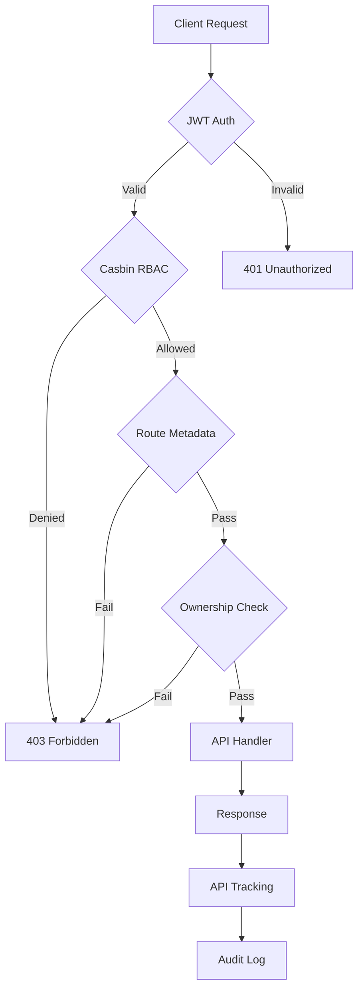
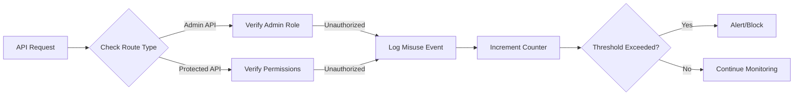
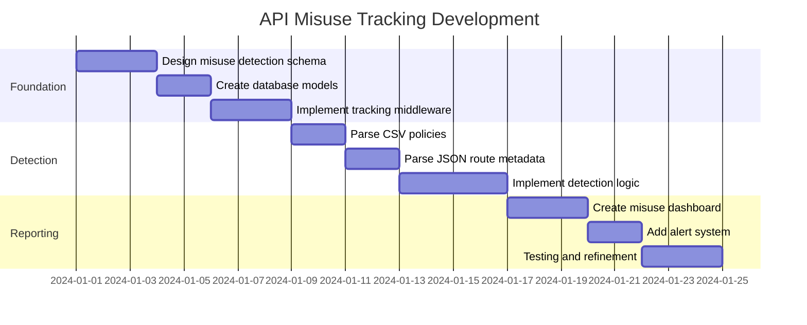
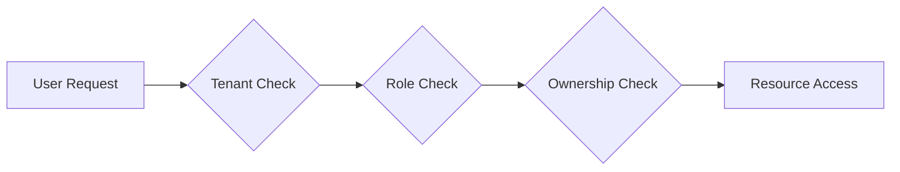
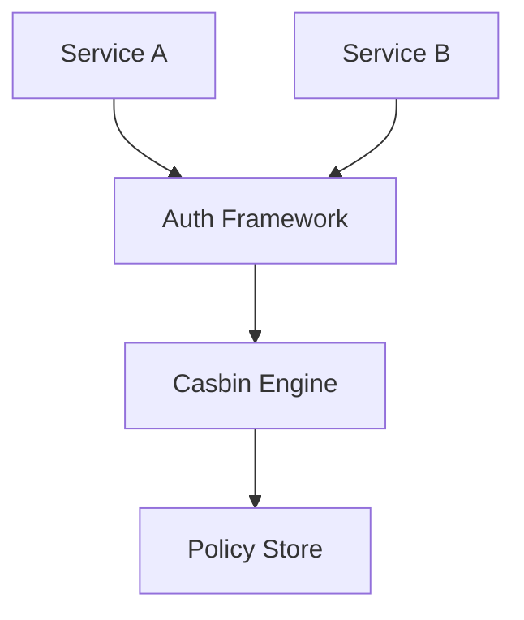
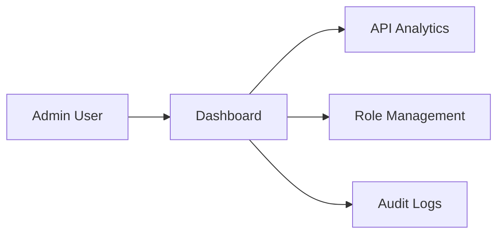

# 🔐 Auth Z Framework

> [!info] Enterprise Authorization Framework
> A comprehensive, evolving authorization framework built with Go, featuring JWT authentication, Casbin-based RBAC, API tracking, and a modern admin dashboard.

---

## 📋 Quick Navigation

```dataview
table file.mtime as "Last Modified"
from "AuthZFramework"
where file.name != "Auth Z Framework"
sort file.mtime desc
limit 10
```

### 🎯 Core Documentation
- [[QUICKSTART|Quick Start Guide]] - Get started in 5 minutes
- [[FEATURES|Features Overview]] - Complete feature list
- [[DASHBOARD|Dashboard Guide]] - Admin UI documentation
- [[UI_ARCHITECTURE|UI Architecture]] - Template system guide

### 📚 Implementation Guides
- [[IMPLEMENTATION_SUMMARY|Implementation Summary]]
- [[DOCS_RENDERER_GUIDE|Documentation Renderer]]
- [[ROLE_MANAGEMENT_IMPLEMENTATION|Role Management]]

### 🚀 Development
- [[#Development Timeline]] - Feature roadmap
- [[#API Misuse Tracking]] - Security monitoring feature

---

## 🌟 Framework Overview



> [!abstract] Architecture Layers
> 1. **Authentication Layer** - JWT token validation
> 2. **Authorization Layer** - Casbin policy enforcement
> 3. **Metadata Layer** - Route-specific permissions
> 4. **Ownership Layer** - Resource-level access control
> 5. **Tracking Layer** - Usage analytics and audit logs

---

## ✨ Key Features

### 🔑 Authentication & Authorization
- [x] JWT-based authentication
- [x] Casbin RBAC policy engine
- [x] Route metadata management
- [x] Resource ownership validation
- [x] Comprehensive audit logging

### 📊 Monitoring & Analytics
- [x] Real-time API usage tracking
- [x] Performance monitoring
- [x] Error rate analysis
- [x] 7-day trend visualization
- [ ] API misuse detection *(in development)*

### 🎨 Admin Dashboard
- [x] Modern responsive UI
- [x] Dark mode support
- [x] API analytics page
- [x] Route metadata management
- [x] Role management interface
- [ ] User management UI *(planned)*
- [ ] Policy editor UI *(planned)*

### 🛡️ Security Features
- [x] Multi-layer authorization
- [x] XSS protection
- [x] Path traversal prevention
- [x] Secure session management
- [ ] **API Misuse Tracking** *(in development)*
- [ ] Rate limiting UI *(planned)*

---

## 🚨 API Misuse Tracking

> [!warning] New Security Feature
> Detect and prevent unauthorized access attempts to admin and protected APIs

### Feature Overview



### Detection Criteria

> [!danger] Misuse Indicators
> - Accessing admin APIs without admin role
> - Repeated 403 Forbidden responses
> - Accessing deprecated endpoints
> - Unusual access patterns
> - Token manipulation attempts

### Data Sources
1. **CSV Policy File** (`casbin_rbac_policy.csv`)
   - Role definitions
   - Permission mappings
   - User-role assignments

2. **JSON Route Metadata** (`enterprise_route_metadata.json`)
   - Admin API markers
   - Protected endpoints
   - Ownership requirements
   - Audit flags

### Tracking Metrics

| Metric | Description | Threshold |
|--------|-------------|-----------|
| Failed Auth Attempts | 401/403 responses | 5 per hour |
| Admin API Access | Non-admin users | 3 per day |
| Deprecated API Usage | Accessing deprecated routes | 10 per day |
| Ownership Violations | Resource access failures | 5 per hour |

---

## 📅 Development Timeline

> [!tip] Evolving Framework
> This framework is continuously evolving with new features and improvements

### Phase 1: API Misuse Detection (Weeks 1-2)



#### Week 1: Foundation & Detection
- [ ] **Day 1-2**: Database schema design
  - Create `api_misuse_events` table
  - Define event types and severity levels
  - Add indexes for performance

- [ ] **Day 3-4**: Middleware implementation
  - Extend existing tracking middleware
  - Add misuse detection hooks
  - Integrate with audit logging

- [ ] **Day 5-7**: Detection logic
  - Parse Casbin CSV policies
  - Parse route metadata JSON
  - Implement pattern matching
  - Add threshold monitoring

#### Week 2: Dashboard & Alerts
- [ ] **Day 8-10**: Dashboard UI
  - Create misuse events page
  - Add real-time alerts widget
  - Implement event filtering
  - Add export functionality

- [ ] **Day 11-12**: Alert system
  - Email notifications
  - Webhook integration
  - Configurable thresholds
  - Alert suppression rules

- [ ] **Day 13-14**: Testing & documentation
  - Unit tests
  - Integration tests
  - Update documentation
  - Create usage examples

### Phase 2: Advanced Features (Weeks 3-4)

- [ ] **Week 3**: Machine learning anomaly detection
  - Baseline behavior modeling
  - Anomaly scoring algorithm
  - Auto-tuning thresholds

- [ ] **Week 4**: Response automation
  - Auto-blocking suspicious IPs
  - Rate limiting integration
  - Incident response workflows

### Phase 3: Integration & Polish (Week 5)

- [ ] Integration with external SIEM systems
- [ ] Advanced reporting and analytics
- [ ] Performance optimization
- [ ] Security audit

---

## 🗂️ File Structure

```
AuthZFramework/
├── 📄 Auth Z Framework.md          # This file (Home)
├── 📘 QUICKSTART.md                # Quick start guide
├── 📗 FEATURES.md                  # Feature documentation
├── 📙 DASHBOARD.md                 # Dashboard guide
├── 📕 IMPLEMENTATION_SUMMARY.md    # Implementation details
├── 🎨 UI_ARCHITECTURE.md           # UI design patterns
├── 🔧 DOCS_RENDERER_GUIDE.md       # Documentation system
└── 📊 Development/
    ├── API_MISUSE_TRACKING.md      # Misuse detection spec
    ├── TIMELINE.md                 # Development schedule
    └── CHANGELOG.md                # Version history
```

---

## 🔧 Quick Setup

> [!example] Minimal Integration
> ```go
> package main
> 
> import (
>     "github.com/aruncs31s/etlabauthzframework"
>     "github.com/gin-gonic/gin"
> )
> 
> func main() {
>     // Initialize framework
>     etlabauthzframework.InitAuthZModule(nil, nil)
>     defer etlabauthzframework.StopAuthZModule()
>     
>     // Initialize tracking
>     etlabauthzframework.InitUsageTracking()
>     
>     // Setup router
>     r := gin.Default()
>     r = etlabauthzframework.SetAuthZMiddleware(r)
>     r = etlabauthzframework.SetApiTrackingMiddleware(r)
>     r = etlabauthzframework.SetupUI(r)
>     
>     // Start server
>     r.Run(":8080")
> }
> ```

---

## 📊 Current Status

> [!success] Production Ready
> - ✅ Core authorization features
> - ✅ Admin dashboard
> - ✅ API tracking and analytics
> - ✅ Role management UI
> - ✅ Documentation system

> [!warning] In Development
> - 🚧 API misuse tracking
> - 🚧 Advanced anomaly detection
> - 🚧 Auto-response system

> [!info] Planned Features
> - 📋 User management UI
> - 📋 Policy editor UI
> - 📋 Rate limiting UI
> - 📋 External identity providers

---

## 🎯 Use Cases

### Multi-Tenant SaaS


### Microservices Authorization


### Internal Admin Tools


---

## 📈 Metrics & KPIs

> [!note] Framework Statistics
> - **Total Routes**: Tracked via route metadata
> - **API Calls**: Real-time tracking
> - **Response Time**: Average latency monitoring
> - **Error Rate**: Failed request percentage
> - **Security Events**: Audit log entries

---

## 🔗 External Resources

- [Casbin Documentation](https://casbin.org/docs/overview)
- [JWT Best Practices](https://tools.ietf.org/html/rfc8725)
- [OWASP API Security](https://owasp.org/www-project-api-security/)
- [Go Security Guidelines](https://golang.org/doc/security)

---

## 🤝 Contributing

> [!tip] Contribution Guidelines
> 1. Fork the repository
> 2. Create a feature branch
> 3. Follow coding standards
> 4. Add tests for new features
> 5. Update documentation
> 6. Submit pull request

---

## 📝 Version History

| Version | Date | Features |
|---------|------|----------|
| 1.0.0 | 2024-01 | Initial release with core features |
| 1.1.0 | 2024-02 | Added dashboard UI |
| 1.2.0 | 2024-03 | Role management interface |
| 1.3.0 | 2024-04 | Documentation renderer |
| 2.0.0 | TBD | API misuse tracking |

---

## 📞 Support

> [!question] Need Help?
> - 📖 Check the [[QUICKSTART|Quick Start Guide]]
> - 📚 Read the [[FEATURES|Features Documentation]]
> - 🐛 Report issues on GitHub
> - 💬 Join community discussions

---

*Last Updated: 2024-01-15*
*Framework Version: 1.3.0*
*Status: 🟢 Active Development*
