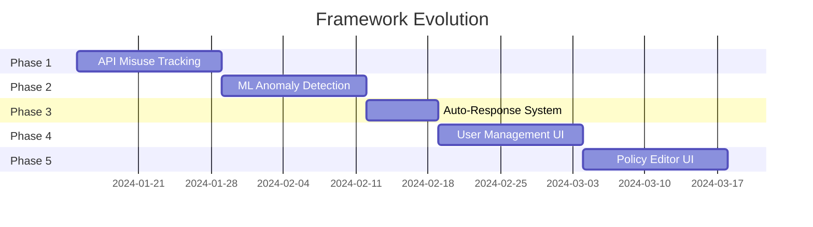

# 📅 Development Timeline

> [!tip] Evolving Framework
> Continuous development roadmap for Auth Z Framework

## Current Sprint: API Misuse Tracking

### Week 1: Foundation (Days 1-7)

#### Day 1-2: Database & Models
- [ ] Design `api_misuse_events` table schema
- [ ] Create GORM models
- [ ] Add database migrations
- [ ] Create indexes for performance

#### Day 3-4: CSV/JSON Parsing
- [ ] Implement Casbin CSV parser
- [ ] Implement route metadata JSON parser
- [ ] Cache parsed data for performance
- [ ] Add hot-reload capability

#### Day 5-7: Detection Middleware
- [ ] Create misuse detection middleware
- [ ] Integrate with existing auth middleware
- [ ] Implement detection rules
- [ ] Add event logging

### Week 2: Dashboard & Alerts (Days 8-14)

#### Day 8-10: Dashboard UI
- [ ] Create misuse events page template
- [ ] Add real-time events table
- [ ] Implement filtering and search
- [ ] Add export to CSV functionality

#### Day 11-12: Alert System
- [ ] Implement threshold monitoring
- [ ] Add email notification service
- [ ] Create webhook integration
- [ ] Add alert configuration UI

#### Day 13-14: Testing
- [ ] Unit tests for detection logic
- [ ] Integration tests
- [ ] Load testing
- [ ] Documentation updates

## Future Phases

### Phase 2: ML Anomaly Detection (Weeks 3-4)
- [ ] Collect baseline behavior data
- [ ] Implement anomaly scoring
- [ ] Auto-tune thresholds
- [ ] Add ML model training

### Phase 3: Auto-Response (Week 5)
- [ ] IP blocking mechanism
- [ ] Rate limiting integration
- [ ] Incident response workflows
- [ ] Recovery procedures

### Phase 4: User Management UI (Weeks 6-7)
- [ ] User CRUD operations
- [ ] Role assignment interface
- [ ] Bulk operations
- [ ] User activity logs

### Phase 5: Policy Editor UI (Weeks 8-9)
- [ ] Visual policy editor
- [ ] Policy testing interface
- [ ] Version control
- [ ] Import/export policies

## Milestones

## Version Roadmap

| Version | Target Date | Key Features |
|---------|-------------|--------------|
| 2.0.0 | 2024-02-01 | API Misuse Tracking |
| 2.1.0 | 2024-02-15 | ML Anomaly Detection |
| 2.2.0 | 2024-03-01 | Auto-Response System |
| 3.0.0 | 2024-03-15 | User Management UI |
| 3.1.0 | 2024-04-01 | Policy Editor UI |
