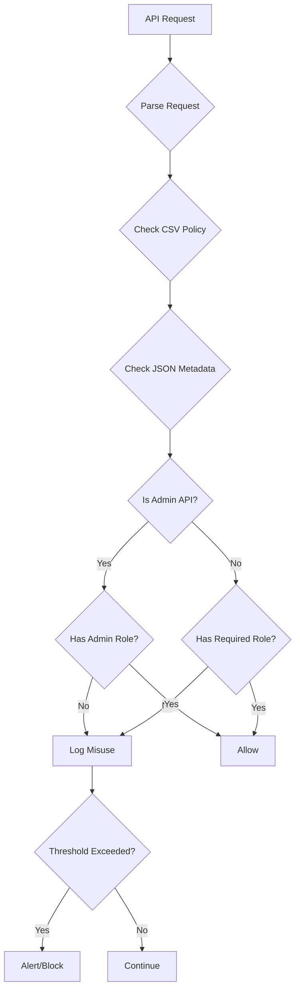
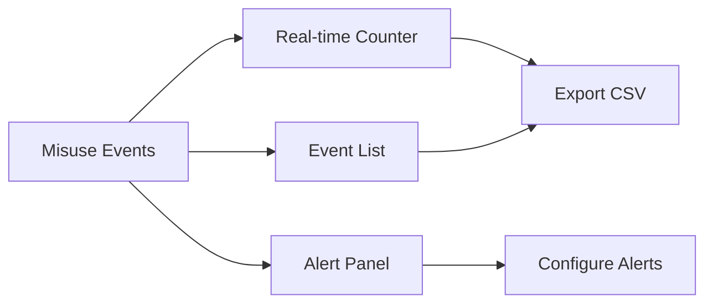

# 🚨 API Misuse Tracking Specification

> [!abstract] Overview
> Real-time detection and prevention of unauthorized API access attempts

## Detection Logic



## Database Schema

```sql
CREATE TABLE api_misuse_events (
    id INTEGER PRIMARY KEY,
    timestamp DATETIME,
    user_id TEXT,
    username TEXT,
    endpoint TEXT,
    method TEXT,
    required_role TEXT,
    user_role TEXT,
    event_type TEXT, -- 'admin_access', 'role_violation', 'deprecated_api'
    severity TEXT,   -- 'low', 'medium', 'high', 'critical'
    ip_address TEXT,
    user_agent TEXT,
    response_code INTEGER
);
```

## Event Types

> [!danger] Critical Events
> - Admin API access without admin role
> - Repeated authorization failures (>5/hour)
> - Token manipulation attempts

> [!warning] Medium Events
> - Deprecated API usage
> - Ownership check failures
> - Unusual access patterns

> [!info] Low Events
> - First-time access denials
> - Public API rate limit warnings

## Implementation

### Middleware Hook
```go
func MisuseDetectionMiddleware() gin.HandlerFunc {
    return func(c *gin.Context) {
        // Extract user info
        // Check against CSV policies
        // Check against JSON metadata
        // Log if misuse detected
        // Increment counters
        // Alert if threshold exceeded
    }
}
```

### Detection Rules
1. **Admin API Check**: Route path contains `/admin/` or metadata marks as admin
2. **Role Mismatch**: User role not in `allowed_roles` from JSON
3. **Deprecated Access**: Route marked as `deprecated: true`
4. **Ownership Violation**: `ownership_check: true` but user != resource owner

## Dashboard Widget



## Configuration

```json
{
  "misuse_tracking": {
    "enabled": true,
    "thresholds": {
      "admin_access_attempts": 3,
      "role_violations_per_hour": 5,
      "deprecated_api_calls": 10
    },
    "alerts": {
      "email": true,
      "webhook": true,
      "block_user": false
    }
  }
}
```
