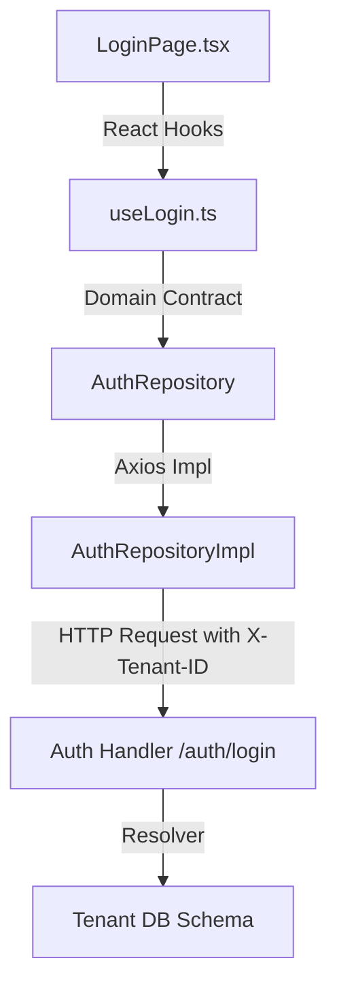

---
tags:
  - architecture
  - auth
  - login
  - documentation
---

#   Authentication Module: Login Flow

This document details the multi-tenant login flow of the ERP. It adheres strictly to the **Single Responsibility Principle (SRP)**, detailing the separation of concerns between HTTP requests, state orchestration, UI layouts, and database schema resolution.

---

## 🛠️ System Architecture (SRP Separation)

The login workflow is split into four distinct layers, ensuring that no single component has multiple reasons to change:



### 1. The Contract Layer (Domain)
* **File**: `domain/repositories/auth.repository.ts`
* **Responsibility**: Defines the login payload contract (`LoginCredentials`) and expected returns (`AuthResponse`). Completely decoupled from HTTP transport.

### 2. The Transport Layer (Infrastructure)
* **File**: `shared/repositories/auth.repository.impl.ts`
* **Responsibility**: Implements `AuthRepository` using Axios. Maps the chosen `tenantId` to the `X-Tenant-ID` HTTP request header so that the backend knows which tenant database schema to query.

### 3. The Orchestration Layer (State/Hook)
* **File**: `modules/auth/hooks/useLogin.ts`
* **Responsibility**: Manages form submission status, UI loading state, validation rules (via Zod), and local store updates. It does not render UI elements or directly call HTTP libraries.

### 4. The Presentation Layer (UI Component)
* **File**: `modules/auth/pages/LoginPage.tsx`
* **Responsibility**: Renders the login card layout, inputs (email, password), and the tenant dropdown selector. Style parameters are mapped from global Nord theme tokens.

---

##   Model Definitions

### Frontend TypeScript Model
Defined in `types/index.ts`:

```typescript
export type UserRole = 'super_admin' | 'institute_admin' | 'teacher' | 'staff' | 'student';

export interface User {
  id: string;
  email: string;
  name: string;
  role: UserRole;
  tenantId: string;
  avatar?: string;
  createdAt: string;
}

export interface LoginCredentials {
  email: string;
  password: string;
  tenantId?: string; // Empty maps to system Master DB
}

export interface AuthResponse {
  user: User;
  token: string;
}
```

### Backend Go Entity
Defined in `internal/domain/user/entity.go`:

```go
type Role string

const (
	RoleSuperAdmin     Role = "super_admin"
	RoleInstituteAdmin Role = "institute_admin"
	RoleTeacher        Role = "teacher"
	RoleStaff          Role = "staff"
	RoleStudent        Role = "student"
)

type User struct {
	ID        string         `gorm:"type:varchar(36);primaryKey" json:"id"`
	TenantID  string         `gorm:"type:varchar(36);index" json:"tenant_id"`
	Email     string         `gorm:"type:varchar(255);uniqueIndex" json:"email"`
	Password  string         `gorm:"type:varchar(255)" json:"-"`
	FirstName string         `gorm:"type:varchar(100)" json:"first_name"`
	LastName  string         `gorm:"type:varchar(100)" json:"last_name"`
	Role      Role           `gorm:"type:varchar(50)" json:"role"`
	IsActive  bool           `gorm:"default:true" json:"is_active"`
	Phone     string         `gorm:"type:varchar(20)" json:"phone"`
	CreatedAt time.Time      `json:"created_at"`
	UpdatedAt time.Time      `json:"updated_at"`
	DeletedAt gorm.DeletedAt `gorm:"index" json:"-"`
}
```

---

##   API Call & Implementation Code

### Frontend Repository API Implementation
From `shared/repositories/auth.repository.impl.ts`:

```typescript
class AuthRepositoryImpl implements AuthRepository {
  async login(credentials: LoginCredentials): Promise<AuthResponse> {
    // Attach the tenant ID as a header to resolve multi-tenancy databases
    const headers = credentials.tenantId ? { 'X-Tenant-ID': credentials.tenantId } : {}
    
    const response = await axiosClient.post<any>('/auth/login', credentials, { headers })
    const raw = response.data.data
    
    return {
      token: raw.access_token,
      user: {
        id: raw.user.id,
        email: raw.user.email,
        name: raw.user.email.split('@')[0],
        role: raw.user.role,
        tenantId: raw.user.tenant_id,
        createdAt: new Date().toISOString()
      }
    }
  }
}
```

### Backend Handler Code
From `internal/interfaces/http/handlers/auth/handler.go`:

```go
type LoginRequest struct {
	Email    string `json:"email" binding:"required,email"`
	Password string `json:"password" binding:"required"`
}

type LoginResponse struct {
	AccessToken  string  `json:"access_token"`
	RefreshToken string  `json:"refresh_token"`
	ExpiresAt    time.Time `json:"expires_at"`
	User         userDTO `json:"user"`
}

func (h *Handler) Login(c *gin.Context) {
	var req LoginRequest
	if err := c.ShouldBindJSON(&req); err != nil {
		response.BadRequest(c, domainerrors.ErrCodeValidation, err.Error(), nil)
		return
	}

	ctx := c.Request.Context()
	u, err := h.userRepo.FindByEmail(ctx, req.Email)
	if err != nil {
		response.Unauthorized(c, "invalid email or password")
		return
	}

	if !u.IsActive {
		response.Unauthorized(c, "account is disabled")
		return
	}

	if err := bcrypt.CompareHashAndPassword([]byte(u.Password), []byte(req.Password)); err != nil {
		response.Unauthorized(c, "invalid email or password")
		return
	}

	accessToken, err := middleware.GenerateToken(u.ID, u.TenantID, u.Email, string(u.Role), h.cfg.AccessTokenTTL)
	// ... (Token generation & response generation)
}
```

---

##   Multi-Tenant Database Resolution Flow

To support multi-tenancy on localhost development, the resolver resolves databases dynamically:

1. **User Selects College**: The user selects a college (e.g. *Demo University College*) in the UI. 
2. **Subdomain Mapping**: The frontend maps the selected college to its database identifier `c.id` (e.g. `demo`).
3. **Request Dispatch**: The Axios client dispatches `POST /api/v1/auth/login` containing:
   - `X-Tenant-ID` header: `"demo"`
4. **Backend DB Resolution**:
   - The Go `Tenant` middleware intercepts the request, reads `X-Tenant-ID` ("demo"), and resolves the GORM database connection pool to `college_demo`.
   - The user repository queries the `users` table inside `college_demo` to authenticate the email.
5. **Token Generation**:
   - The backend signs a JWT token with claim `"tenant_id": "demo"`.
   - Subsequent authenticated requests read `"demo"` from the token to persistently route all calls to the correct tenant database.

---

##   Related Documentation

- [[02 Registration]] — Flow for student self-registration and custom forms.
- [[03 Schema Migration]] — How master and tenant databases are structured.
