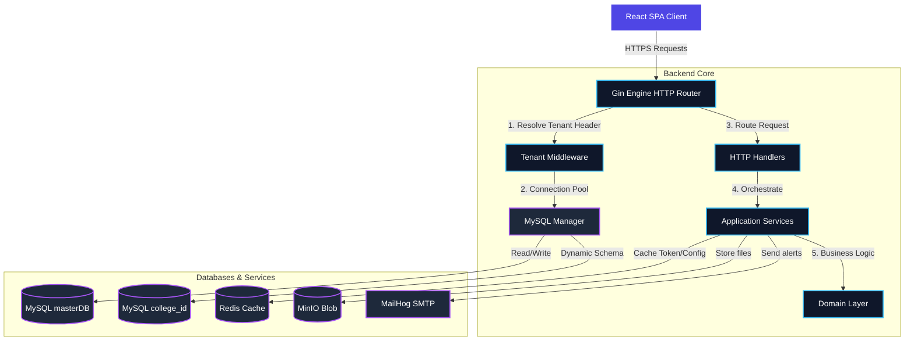

# System Overview & Infrastructure

Welcome to the **College Education ERP** project documentation. This note serves as the entry point for the system's technical infrastructure, outlining the monorepo structure, containerized environments, and how the components link together.

## Vault Navigation
- **Architecture**:
  - [[Backend Architecture]] - Go Clean Architecture, DDD, Dynamic Connection Pooling, and Auth/Casbin.
  - [[Frontend Architecture]] - React, Vite, Zustand, module-based page structures, and CSS.
  - [[Database Schema]] - Master vs. Tenant schema layouts, entities, and relations.
  - [[Scalable Extension Guidelines]] - Coding guidelines for extending features using repository patterns, hooks, and shared constants.
- **Business Modules**:
  - [[../Registration/Registration Module|Registration Module]] - Application pipeline, OCR documents, and Gale-Shapley Seat Allocation.

---

## Monorepo Layout
The project is structured as a monorepo containing both the backend and frontend codebases, with orchestrators in the root.

```
.
├── backend/               # Go DDD Backend Service
├── frontend/              # Vite + React + TS Frontend
├── docker-compose.yml     # Infrastructure Service Orchestration
├── Makefile               # CLI Commands for local builds & orchestration
├── .env                   # Root Environment Configuration
└── .env.example
```

---

## Infrastructure Services
Local development is fully containerized using **Docker Compose**, running the following dependencies:

| Service | Technology | Port | Purpose |
| :--- | :--- | :--- | :--- |
| **Relational Database** | MySQL 8.0 | `3306` | Persistent store for Master and Tenant databases. |
| **Caching & Session** | Redis | `6379` | Temporary token store, rate limiting, and session caching. |
| **Object Storage** | MinIO (S3) | `9000` (API) / `9001` (Console) | Secure storage for student uploads (identity cards, grade sheets). |
| **Email Testing** | MailHog | `1025` (SMTP) / `8025` (Web UI) | Local SMTP server catching sent notifications for testing. |

---

## System Architecture Flow


---

## Global Automation Commands (Makefile)
The root `Makefile` provides immediate tools for launching, seeding, and verifying the application:

- `make up` - Launches MySQL, Redis, MinIO, and MailHog containers in background.
- `make down` - Stops all running docker containers.
- `make backend-run` - Starts the Go server locally on port `8082`.
- `make frontend-run` - Starts the Vite dev server on port `3001`.
- `make seed-db` - Runs the Go seeder tool (`cmd/seed`) to populate database tenants (`demo` college), roles, users, and dummy applications.
- `make test` - Executes Go package unit tests.
