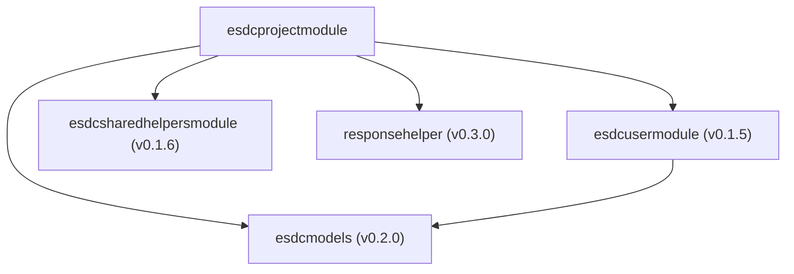
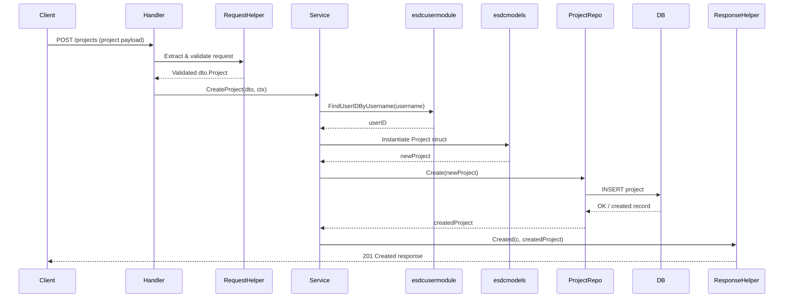

# ESDC Modules 

![[4482735.png]]

> [!SUMMARY]+ Table of Contents
> - [Introduction](#introduction)
> - [1. esdcmodels (v0.2.0)](#1-esdcmodels-v0.2.0)
> - [2. esdcusermodule (v0.1.5)](#2-esdcusermodule-v0.1.5)
> - [3. esdcsharedhelpersmodule (v0.1.6)](#3-esdcsharedhelpersmodule-v0.1.6)
> - [4. responsehelper (v0.3.0)](#4-responsehelper-v0.3.0)
> - [Module Dependencies Diagram](#module-dependencies-diagram)
> - [How Modules Work Together](#how-modules-work-together)
> - [Capabilities Enabled by These Modules](#capabilities-enabled-by-these-modules)
> - [Future Module Integration Opportunities](#future-module-integration-opportunities)
> - [Dependency Versions](#dependency-versions)
> - [How to Update Modules](#how-to-update-modules)


## Introduction 
Why ESDC Modules exists? , i began this project thinking that i can keep adding features until i ran out of ideas , and split the files into folders like services, handlers , repository etc and follow a basic , solid architecture. But as i introduce more and more features , i am not able to search trough it using the normal vscode search , which means there are lot of files , and we should find some way to seperate them. Actually that is not the reason , i did it mainly so that , everyone can focus on their own modules and not to worry about other modules,
they can 

1. Develop their own modules independently
2. Test their own modules independently
3. Deploy their own modules independently
and at last 
4. Integrate them all to the main project.

---

## Introduction

> [!INFO]
> Why ESDC Modules exists? Initially this project was designed to keep adding features until running out of ideas, split into folders like services, handlers, and repository following a basic solid architecture. However, as more features were introduced, searching through the codebase became difficult due to the large number of files.
>
> The solution: **Separate concerns into independent modules** so that:
> 1. **Develop** modules independently
> 2. **Test** modules independently
> 3. **Deploy** modules independently
> 4. **Integrate** them all into the main project

---

## Module Dependencies Diagram



---

## 1. esdcmodels (v0.2.0)

> [!NOTE]- Why "esdcmodels"?
> Central shared data models library that defines the domain entities used across all ESDC modules.

> [!INFO] What It Provides
> - **Project Model**: Core project entity with fields for title, description, status, etc.
> - **User Model**: User entity with ID, username, email, image, etc.
> - **Relationships**: Many-to-many relationships like:
>   - Projects ↔ Contributors
>   - Projects ↔ Tags
>   - Projects ↔ Technologies
>   - Users ↔ Liked Projects
>   - Users ↔ Viewed Projects
> - **Helper Models**: Tag, Technologies, Comment, Review, etc.

**How It's Used:**
```go
import commonModules "github.com/aruncs31s/esdcmodels"

// Used in service layer
var projects []commonModules.Project

// Used in repository layer with GORM
projectRepo.GetByID(id) (commonModules.Project, error)
```

> [!SUCCESS] What It Enables
> - Consistent data structure across all services
> - Database schema definitions via GORM tags
> - Relationship management between entities
> - Type safety and shared domain knowledge
> - Single source of truth for all models

---

## 2. esdcusermodule (v0.1.5)

> [!NOTE]- Why "esdcusermodule"?
> Dedicated user management module that handles user authentication, user data retrieval, and user-related operations.

> [!INFO] What It Provides
> - **User Repository**: Methods to find users by ID, username, or email
> - **User Authentication**: Integration with JWT middleware
> - **User Lookup Methods**:
>   - `FindUserIDByUsername(username)` - Get user ID from username
>   - `FindByID(id)` - Get full user details
>   - `FindUsersByUsernames(usernames)` - Batch lookup users
> - **User Validation**: Verify users exist and are valid

**How It's Used:**
```go
import userRepo "github.com/aruncs31s/esdcusermodule/repository"

// In InitProjectModule
userRepository := userRepo.NewUserRepository(db)

// In CreateProject service
userID, err := userRepository.FindUserIDByUsername(user)
creator, err := userRepository.FindByID(userID)
contributors, err := userRepository.FindUsersByUsernames(contributorUsernames)
```

> [!SUCCESS] What It Enables
> - Validate users before assigning them to projects
> - Cross-module user references without duplication
> - Centralized user data management
> - User authentication context passing between modules
> - Prevent invalid user assignments to projects

---

## 3. esdcsharedhelpersmodule (v0.1.6)

> [!NOTE]- Why "esdcsharedhelpersmodule"?
> Shared utility and helper functions used across multiple modules for common operations.

> [!INFO] What It Provides
> - **RequestHelper**: Methods for handling HTTP requests
>   - `GetLimitAndOffset(c)` - Extract pagination parameters from request
>   - `GetUserFromContext(c)` - Get authenticated user from request context
> - **RequestValidator**: Validation utilities for incoming requests
>   - Input validation
>   - Constraint checking
> - **Error Helpers**: Common error handling patterns
> - **Context Utilities**: Working with Gin context

**How It's Used:**
```go
import sharedHelperImpl "github.com/aruncs31s/esdcsharedhelpersmodule/helper"
import sharedHelper "github.com/aruncs31s/esdcsharedhelpersmodule/interface/helper"

// In handler
requestHelper := sharedHelperImpl.NewRequestHelper()
limit, offset := requestHelper.GetLimitAndOffset(c)

validator := sharedHelperImpl.NewRequestValidator()
```

> [!SUCCESS] What It Enables
> - Consistent request handling across modules
> - Standardized pagination (limit/offset)
> - Reusable validation logic
> - Reduced code duplication
> - Common error handling patterns

---

## 4. responsehelper (v0.3.0)

> [!NOTE]- Why "responsehelper"?
> Standardized HTTP response formatting library ensuring consistent API responses across all endpoints.

> [!INFO] What It Provides
> - **Response Methods**:
>   - `Success(c, data)` - 200 OK response
>   - `Created(c, data)` - 201 Created response
>   - `BadRequest(c, message, details)` - 400 error
>   - `Unauthorized(c, message)` - 401 error
>   - `NotFound(c, message)` - 404 error
>   - `InternalError(c, message, error)` - 500 error
> - **Consistent Response Format**: All responses follow a standard structure

**How It's Used:**
```go
import "github.com/aruncs31s/responsehelper"

// In handler
responseHelper := responsehelper.NewResponseHelper()

// Using different response types
h.responseHelper.Success(c, projects)
h.responseHelper.Created(c, createdProject)
h.responseHelper.NotFound(c, "Project not found")
h.responseHelper.Unauthorized(c, "Authentication required")
```

> [!SUCCESS] What It Enables
> - Uniform API response structure
> - Predictable status codes
> - Consistent error message formatting
> - Better client-side error handling
> - Professional API interface

---

## How Modules Work Together

### Example: Creating a Project



> [!TIP] Data Flow Summary
> 1. **Handler** receives and validates request using RequestHelper
> 2. **Service** validates users with esdcusermodule
> 3. **Service** creates model instance from esdcmodels
> 4. **Repository** persists to database
> 5. **ResponseHelper** formats and sends standardized response

---

## Capabilities Enabled by These Modules

### 1. Multi-User Project Management

> [!EXAMPLE]
> - Create projects with multiple contributors
> - Track project creator and modification history
> - Validate contributor existence before assignment

### 2. Consistent API Interface

> [!EXAMPLE]
> - Standardized request/response formats
> - Predictable error handling
> - Professional HTTP status codes

### 3. Data Integrity & Relationships

> [!EXAMPLE]
> - Many-to-many relationships (Projects ↔ Contributors, Tags, Technologies)
> - Enforce foreign key constraints
> - Preload related data efficiently

### 4. Code Reusability

> [!EXAMPLE]
> - Shared helpers reduce duplication
> - Common validation patterns
> - Centralized user management

### 5. Scalability & Maintainability

> [!EXAMPLE]
> - Modular architecture allows independent updates
> - Separated concerns (models, users, helpers, responses)
> - Easy to test individual components

---

## Future Module Integration Opportunities

> [!TIP] Suggested New Modules
> 1. **esdcauthmodule** - JWT token generation/validation
> 2. **esdcfilestorage** - Image/file upload handling
> 3. **esdc-github-integration** - GitHub API integration for star counts, forks
> 4. **esdcnotificationmodule** - Email/notification system
> 5. **esdcanalytics** - Usage tracking and analytics

---

## Dependency Versions

| Module | Version | Status |
|--------|---------|--------|
| esdcmodels | v0.2.0 | Current |
| esdcusermodule | v0.1.5 | Current |
| esdcsharedhelpersmodule | v0.1.6 | Current |
| responsehelper | v0.3.0 | Current |
| gin-gonic/gin | v1.11.0 | Current |
| gorm | v1.31.0 | Current |

---

## How to Update Modules

> [!WARNING] Before Updating
> Always test thoroughly after updating dependencies to ensure compatibility.

```bash
# Update a specific module
go get -u github.com/aruncs31s/esdcmodels@latest

# Update all direct dependencies
go get -u ./...

# Check for available updates
go list -u -m all
```

---

## Key Takeaway

> [!ABSTRACT]
> These modules form a **microservices-like architecture** where:
> - **esdcmodels** = Shared Data Layer
> - **esdcusermodule** = User Service
> - **esdcsharedhelpersmodule** = Utilities
> - **responsehelper** = API Response Standard
> - **esdcprojectmodule** = Project Service (this module)
>
> This design allows each module to be developed, tested, and deployed independently while maintaining consistency across the entire ESDC platform.
>