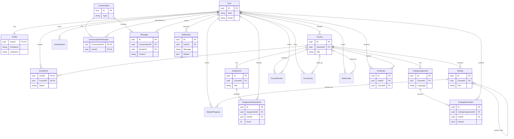

# Database Schemas & Domain Models

The application models its domain entities using GORM. Below are the primary entities and their relationships.

## Core Entities

### User
Users represent all actors in the system.
- Roles: Admin, Teacher, Student
- Relationships: One-to-Many with Courses (created), Enrollments, Achievements, Submissions, Messages.

### Course
Core educational content container.
- Includes details like Title, Description, Thumbnail, Price, and Status (Published/Draft).
- Relationships: One-to-Many with Modules, Assignments, Coding Assignments, Reviews, Likes.

### Course Module
Sections inside a course containing the actual content (videos, text).

### Assignment & Submission
Standard assignments where users can upload documents or submit text.
- Grading is handled by teachers, updating the `Score` and `Feedback`.

### Coding Assignment
Specialized assignments evaluated via a code-runner execution environment.
- Contains predefined test cases, constraints (time, memory), and starter code.

### Certificate
Awarded upon course completion.
- Tracks the generated PDF file path and unique certificate ID.

### Notifications & Chat Message
- **Notifications**: System alerts for users (e.g., assignment graded, new course).
- **Chat Messages**: Direct messaging or course group messaging payloads, managed via websockets and stored here.

*(All models use standard GORM conventions, typically implementing `gorm.Model` for ID, CreatedAt, UpdatedAt, and DeletedAt soft deletes.)*

## Entity-Relationship Diagram

