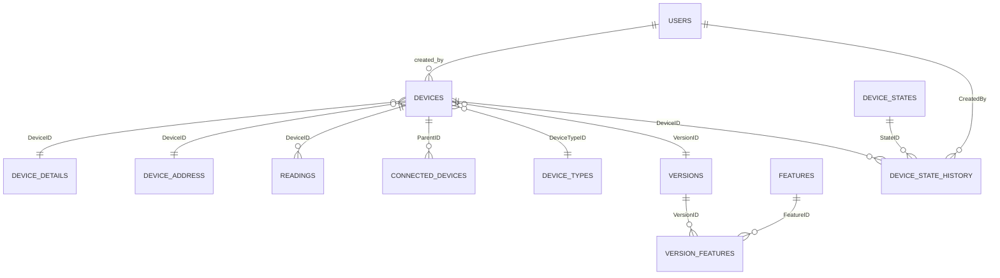

# Models and Relationships 📦

This document summarizes the data models in `internal/model` and their relationships (as represented in GORM tags). It includes a brief description of each model, key fields, and how they relate to each other.

---

## Overview

Primary entities:
- **Device** — central entity representing a physical device (ESP32, sensor, gateway, etc.)
- **DeviceTypes** — type metadata (hardware type, name)
- **Version** / **Feature** — firmware/software versioning and feature flags
- **Reading** — telemetry samples (voltage, current)
- **DeviceDetails** / **DeviceAddress** — supplementary device info (network, address)
- **DeviceState** / **DeviceStateHistory** — device lifecycle and state changes
- **ConnectedDevice** — parent/child device link (e.g., LED as subdevice)
- **User**, **UserDetail** — user accounts & metadata
- **AuditLog** — audit trails for user/device actions

---

## ER Diagram (textual)

User --< Device
DeviceTypes --< Device >-- Version --< VersionFeatures >-- Feature
Device --< Reading
Device -- DeviceDetails (1:1)
Device -- DeviceAddress (1:1)
Device --< ConnectedDevice (as Parent)
DeviceState --< DeviceStateHistory (DeviceStateHistory.Device -> Device)
AuditLog -> Device (optional) and -> User

Representative arrows:
- `A --< B` : one-to-many (A has many B)
- `A -> B`  : reference/foreign key from A to B

---

## Model details

### Device
- Table: `devices`
- Key fields: `ID`, `Name`, `DeviceTypeID`, `VersionID`, `CurrentState`
- Relations:
  - `DeviceType` (fk `DeviceTypeID` -> `device_types.id`)
  - `Version` (fk `VersionID` -> `versions.id`)
  - `Details` (1:1 on `DeviceDetails` via `DeviceID`)
  - `Address` (1:1 on `DeviceAddress` via `DeviceID`)
  - `Readings` (1:N `readings` by `DeviceID`)
  - `ConnectedDevices` (1:N as parent via `ConnectedDevice.ParentID`)
  - `DeviceState` (fk `CurrentState` -> `device_states.id`)
- Notes:
  - Current state transitions are declared in `DeviceStateTransitions` and `DeviceStateActionResult` maps.

### DeviceTypes
- Table: `device_types`
- Fields: `ID`, `Name`, `HardwareType` (enum: Unknown, MicroController, SingleBoardComputer, Sensor)
- Notes: Hardware enum provides helper methods (`CanControl()`, `String()`).

### Version, Feature, VersionFeature
- `Version` (table `versions`) belongs to a `Device` (DeviceID) and may point to a `PreviousVersion`.
- `Feature` (table `features`) is a feature flag with `Enabled` boolean.
- Many-to-many: `Version` <-> `Feature` via `version_features` (junction table `VersionFeature`).

### Reading
- Table: `readings`
- Fields: `ID`, `DeviceID`, `Voltage`, `Current`, `CreatedAt`
- Relation: belongs-to `Device` via `DeviceID`.

### DeviceDetails
- Table: `device_details`
- Fields: `DeviceID`, `IPAddress`, `MACAddress`, `LastSeenAt`
- Relation: 1:1 with `Device` (Device.Details)

### DeviceAddress
- Table: `device_address`
- Fields: `DeviceID`, `Address`, `City`
- Relation: 1:1 with `Device` (Device.Address)

### ConnectedDevice
- Table: `connected_devices`
- Fields: `ParentID`, `ChildID` (ChildDevice preloaded as `Device`)
- Use-case: model parent-child device relationships (e.g., main device and its peripherals)

### DeviceState & DeviceStateHistory
- `DeviceState` defines possible states (table `device_states`).
- `DeviceStateHistory` records transitions with `DeviceID`, `CausedAction`, `StateID`, `CreatedBy`.
- `DeviceStateHistory` includes `User` who caused action and links back to `Device`.

### User & UserDetail
- `User` table `users`: `ID`, `Name`, `Username`, `Email`, `Password` (not exposed), `Role`, timestamps
- `UserDetail` table `user_details`: `UserID`, `Phone` (1:1 relation)
- `User.Devices` is populated by `CreatedBy` references from `Device` / other models.

### AuditLog
- Table: `audit_logs`
- Fields: `UserID`, `Username`, `Action`, `Details`, `IPAddress`, optional `DeviceID`, `CreatedAt`
- Relations: optional `Device` and `User` foreign keys for context.

---

## Tips & Observations ✅
- GORM tags are used consistently (foreign keys and constraints are present for cascade behavior on `Device` relations).
- `DeviceState` IDs are used directly as foreign keys from `Device.CurrentState`; consider using an explicit foreign key tag if desired to make it explicit for GORM (`foreignKey:CurrentState;references:ID` is present already on `Device` struct).
- `Version` includes `PreviousVersion` pointer which supports version chains.
- Many-to-many `Version <-> Feature` is modeled using `many2many:version_features` — good for querying features per version.

---

## Suggested visual improvement (optional)
You may generate an ER diagram (Graphviz or Mermaid) from this doc if you want visuals. Example Mermaid snippet (paste into MD viewer that supports Mermaid):

---

If you'd like, I can:
1. Add a Mermaid ER diagram into `docs/MODELS.md` and commit it. ✅
2. Generate a PNG/SVG ER diagram using Graphviz and add it to `docs/`.

Which option would you prefer? 🔧