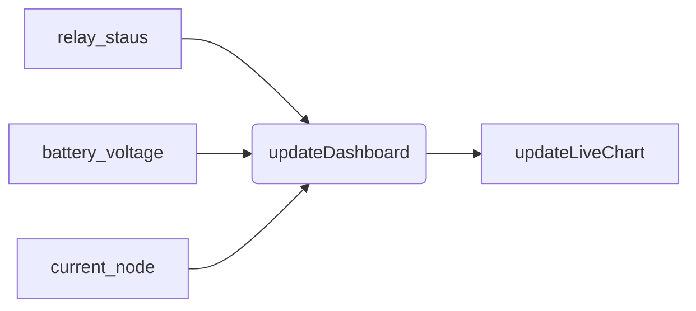

> [!blank|right-small]+ Pages
> There are mainly 4 pages , `Home` , `devices`,`info`, and `about`
>
> - [[01 Projects/02 Web_Based/Kannur Solar Battery Monitor Website/website/Home Page]]
> - [[01 Projects/02 Web_Based/Kannur Solar Battery Monitor Website/website/Device Page]]
> - [[01 Projects/02 Web_Based/Kannur Solar Battery Monitor Website/website/main_page]]
> - [[01 Projects/02 Web_Based/Kannur Solar Battery Monitor Website/website/APIs]]
>   Others
> - [[database]]

# Device Page
- [[Slected Device.js]]
- [[Slected Device.css]]
- [[Selected Device.html]]

The device page should do the following

1. It should show the live reading from the `esp`
2. It should show the past 6 days reading

# Functions
1. updateDashboard()
2. updateLiveChart()
3. updateOldChart_1()
4. updateOldChart_2()
5. updateOldChart_3()
6. updateOldChart_4()
7. updateOldChart_5()
8. updateOldChart_6()

## updateDashboard()



### Get current node 

```javascript
const current_node = document
  .getElementById("current-node")
  .innerHTML.split(":")
  .map((part) => part.trim())[1];

```

### Getting the latest data 

```bash
curl localhost:5000/api/data?device_id=Chittariparamba

```

**node**

```js
const current_node = "Chittariparamba";
fetch(`http://localhost:8000/api/data?device_id=${current_node}`)
  .then((response) => {
    // console.log(response);
    return response.json();
  })
  .then((data) => {
    const latest = data[data.length - 1];
    console.log(latest);
  })
  .catch((error) => console.error("Error fetching data:", error));

```

```javascript
fetch(`/api/data?device_id==${current_node}`))
	.then((data) => {
		const latest = data[data.length - 1];
		const batteryElement = document.getElementById("currentbattery-value",);
		batteryElement.textContent = latest.battery_voltage;
	})
	.catch((error) => console.error("Error fetching data:", error));

```

```js

// Fix setInterval for live updates by removing `await`
setInterval(() => {
  fetch(`/api/data?device_id=${current_node}`)
    .then((response) => response.json())
    .then((latest) => {
      if (latest && latest.hasOwnProperty("battery_voltage")) {
        const x = new Date(latest.timestamp).getTime() + new Date().getTimezoneOffset() * -60000;
        const y = parseFloat(latest.battery_voltage);

        if (charts.battery.series[0].data.length > 4000) {
          charts.battery.series[0].addPoint([x, y], true, true, true);
        } else {
          charts.battery.series[0].addPoint([x, y], true, false, true);
        }

        const batteryElement = document.getElementById("battery");
        if (batteryElement) {
          batteryElement.textContent = latest.battery_voltage;
        }
      } else {
        console.log("No new data available for live update.");
      }
    })
    .catch((error) => console.error("Error fetching live data:", error));
}, 15000);

```

#### Current method

```js

// Fix setInterval for live updates by removing `await`
setInterval(() => {
  fetch(`/api/data?device_id=${current_node}`)
    .then((response) => response.json())
    .then((latest) => {
      if (latest && latest.hasOwnProperty("battery_voltage")) {
        const x = new Date(latest.timestamp).getTime() + new Date().getTimezoneOffset() * -60000;
        const y = parseFloat(latest.battery_voltage);
        if (charts.battery.series[0].data.length > 4000) {
          charts.battery.series[0].addPoint([x, y], true, true, true);
        } else {
          charts.battery.series[0].addPoint([x, y], true, false, true);
        }

        const batteryElement = document.getElementById("battery");
        if (batteryElement) {
          batteryElement.textContent = latest.battery_voltage;
        }
      } else {
        console.log("No new data available for live update.");
      }
    })
    .catch((error) => console.error("Error fetching live data:", error));
}, 5000);

```

But this fails 

#### new Method + async
[type:: Skeliton]

[layer::1]

```js
async function get_latest_data(){}

```

[layer:: 2]

```js
async function get_latest_data(){
  try {}
  catch(error){}
}

```

[layer::3]

```js
async function get_latest_data(){
  try {
	const response = await fetch(`/api/data?device_id=${current_node}`);
	const data = await response.json();
	lates_data = data[data.length - 1];
	console.log("Latest data:", lates_data);
	return lates_data;
  }
  catch(error){
    console.error("Error fetching latest data:", error);
    return null;
  }
}

```

[layer:: 4]

```js

async function get_latest_data() {
  try {
    const response = await fetch(`/api/data?device_id=${current_node}`);
    if (!response.ok) {
      throw new Error(`HTTP error! status: ${response.status}`);
    }
    const data = await response.json();
    if (data.length > 0) {
      lates_data = data[data.length - 1];
      console.log("Latest data:", lates_data);
      return lates_data;
    } else {
      const liveResponse = await fetch(`/api/data/live?device_id=${current_node}`);
      if (!liveResponse.ok) {
        throw new Error(`HTTP error! status: ${liveResponse.status}`);
      }
      const liveData = await liveResponse.json();
      lates_data = liveData["battery_voltage"];
      if (lates_data) {
        console.log("Latest data from live:", lates_data);
        return lates_data;
      } else {
        console.log("No data available for latest");
        return null;
      }
    }
  }
  catch (error) {
    console.error("Error fetching latest data:", error);
    return null;
  }
}

```

### UpdateOldCharts

#### Old Method

```js
async function updateOldChart_1() {
  fetch(`/api/data/old?device_id=${current_node}&day=1`)
    .then((response) => {
      console.log("Response from /api/data (prev_1):", response);
      if (!response.ok) {
        throw new Error(`HTTP error! status: ${response.status}`);
      }
      return response.json();
    })
    .then((data) => {
      if (data.length > 0) {
        const chartData = data.map((reading) => [
          new Date(reading.timestamp).getTime() +
            new Date().getTimezoneOffset() * timeOffset,
          reading.battery_voltage,
        ]);
        charts.old_battery_1.series[0].setData(chartData);
      } else {
        console.log("No data available for prev_1");
        // Optionally clear the chart or show a message
        charts.old_battery_1.series[0].setData([]);
      }
    })
    .catch((error) => console.error("Error fetching data for prev_1:", error));
}

```

#### New method 

```js
async function updateOldChart(day, chart) {
  try {
    const response = await fetch(`/api/data/old?device_id=${current_node}&day=${day}`);
    console.log(`Response from /api/data (prev_${day}):`, response);
    if (!response.ok) {
      throw new Error(`HTTP error! status: ${response.status}`);
    }
    const data = await response.json();
    if (data.length > 0) {
      const chartData = data.map((reading) => [
        new Date(reading.timestamp).getTime() + new Date().getTimezoneOffset() * timeOffset,
        reading.battery_voltage,
      ]);
      chart.series[0].setData(chartData);
    } else {
      console.log(`No data available for prev_${day}`);
      chart.series[0].setData([]);
    }
  } catch (error) {
    console.error(`Error fetching data for prev_${day}:`, error);
  }
}

```

#### merge both 
This the new method. 
- [ ] Check whether we can loop this function ? .

```js
async function updateOldChart_a_1() {
  try {
    const response = await fetch(`/api/data/old?device_id=${current_node}&day=1`);
    console.log(`Response from /api/data (prev_1):`, response);
    if (!response.ok) {
      throw new Error(`HTTP error! status: ${response.status}`);
    }
    const data = await response.json();
    if (data.length > 0) {
      const chartData = data.map((reading) => [
        new Date(reading.timestamp).getTime() + new Date().getTimezoneOffset() * timeOffset,
        reading.battery_voltage,
      ]);
      charts.old_battery_1.series[0].setData(chartData);
    } else {
      console.log(`No data available for prev_1}`);
      charts.old_battery_1.series[0].setData([]);
    }
  } catch (error) {
    console.error(`Error fetching data for prev_1:`, error);
  }
}

```

```js
current_node = 'Chittariparamba'
day=1

async function updateOldChart() {
  try {
    const response = await fetch(`localhost:5000/api/data/old?device_id=${current_node}&day=${day}`);
    console.log(`Response from /api/data (prev_${day}):`, response);
    if (!response.ok) {
      throw new Error(`HTTP error! status: ${response.status}`);
    }
    const data = await response.json();
    if (data.length > 0) {
		console.log(data)
    } else {
      console.log(`No data available for prev_${day}`);
    }
  } catch (error) {
    console.error(`Error fetching data for prev_${day}:`, error);
  }
}
updateOldChart()

```