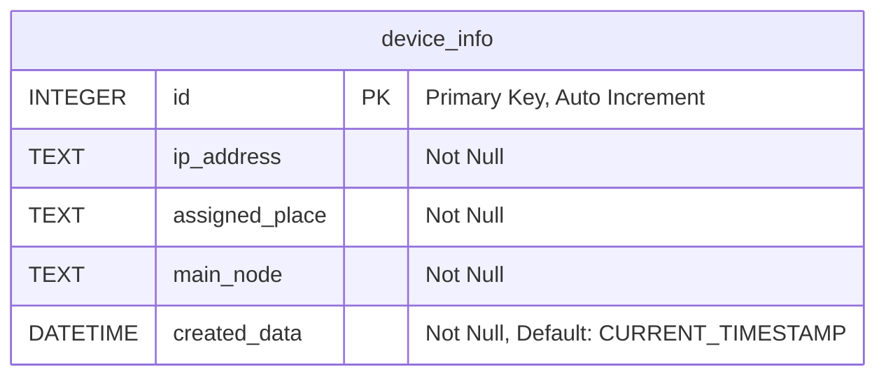
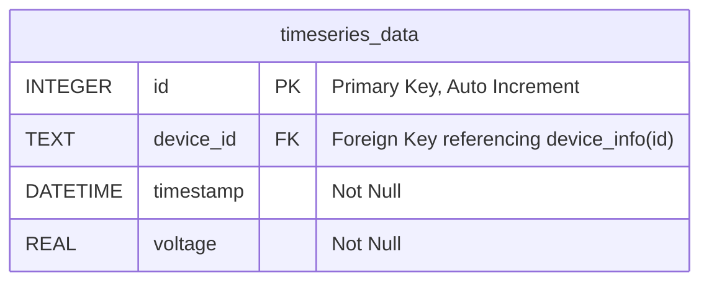
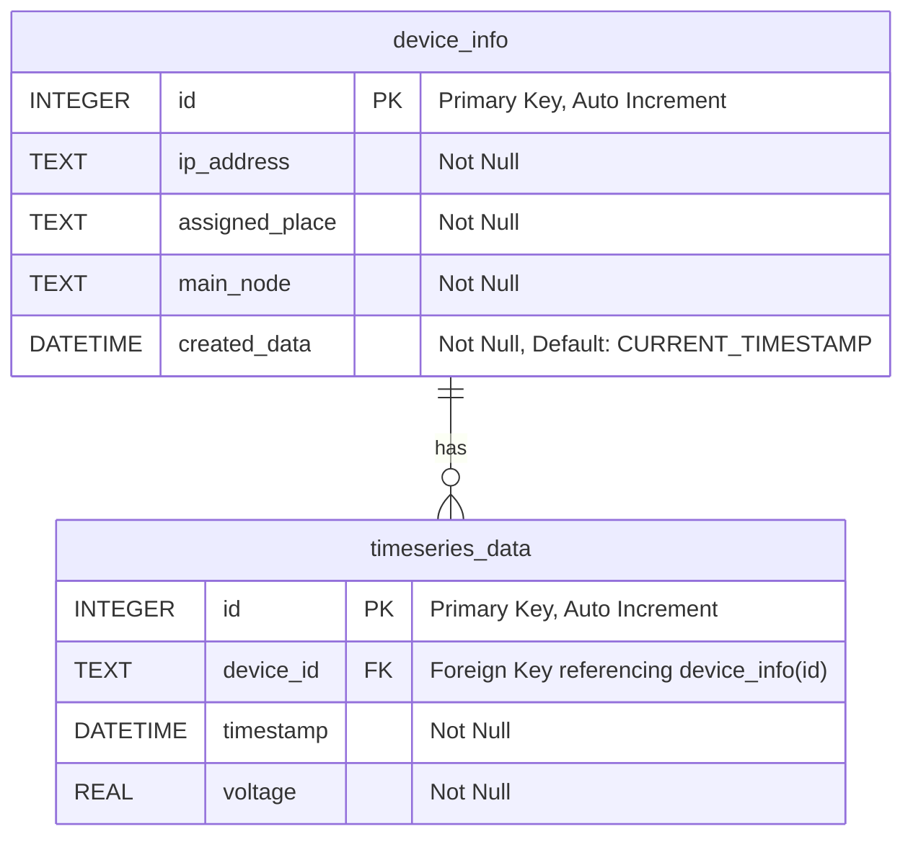

# Database

- [ ] Check if is there any way to minimize the use of database in this project #fix

**Using SQlite3**

```python
import sqlite3

```

```python
sqlite3.register_adapter(datetime, lambda val: val.isoformat())

```

- Used to convert to `ISO 8601` format

## Databses

There are 2 database

1. For the device info
2. and another for the timeseries_data





---



# Functions

#### 1. Update Random Data

This is used to test the functionality without actually the microcontroller connected .

```python
    def update_random_data(self,ip_list):
        self.ip_list = ip_list
        print("Updating random data")
        for ip in self.ip_list:
            print(f"Updating random data for {ip}")
            round_random_voltage = round(random.uniform(8.7, 12), 2)
            self.insert_data(ip ,round_random_voltage)

```

> [!blank|right-small]+
>
> ```

> print(ip_list)
> [
> '192.168.1.1',
> '192.168.1.2',
> '192.168.1.3',
> ]
> ```

It receives a `ip_list` which is the list of ip of all the [[ESP8266]] running .

#### 2. Inserting Data

```python
    def insert_data(self, device_id, voltage):
        # iam planning to use the ip as the device id .
        timestamp = datetime.now()
        # print(timestamp)
        self.cursor.execute(
            """
        INSERT INTO timeseries_data (device_id, timestamp, voltage)
        VALUES (?, ?, ?)
        """,
            (device_id, timestamp, voltage),
        )
        self.conn.commit()

```

#### 3 Updating data from the esp32

**Work:** this will fetch the live data form the [[Esp HttpServer|Server]] and update it to the `charts.battery`
We dont have to store the entire data points in the database, unless necessary .So i am going to do this.

1. The scraped data is instantly send to the `charts.battery` using the following

```python
@app.route("/api/data", methods=["GET"])
def get_data():
    current_node = request.args.get("device_id")
    current_node_ip = esp_devices.get_ip_of_the_node(current_node)
    date_now = datetime.today().date()
    raw_data = db.get_data(current_node_ip,date=date_now)
    data = [
        {
            'timestamp': row[TIME_INDEX].strftime(highcharts_timestamp_format),
            'battery_voltage': row[BAT_INDEX]
        }
        for row in raw_data
    ]
    return jsonify(data), 200

```

this is the current function but it can be modified to get the live data[^1] from the
modifing this to the following. (currently keeping the last data format that is send the same)

```python
@app.route("/api/data/live" methods=["GET"])
def get_live_data():
    current_node = request.args.get("device_id")
    current_node_ip = esp_devices.get_ip_of_the_node(current_node)
    live_data = get_esp_data(current_node_ip)
    data = [
        {
            'timestamp': datetime.today().strftime(highcharts_timestamp_format),
            'battery_voltage': live_data["battery_voltage"],
        }
    ]
    return jsonify(data), 200

```

[^1]: Live data in the sense that it will directly come from the `ESP8266` server itself without any delay.
