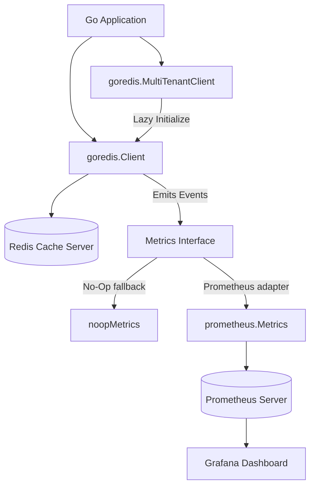

# Goredis Cache Project Overview

Welcome to the documentation repository for the **Goredis Cache Library**. This project is a production-ready, feature-rich caching wrapper for Go applications built on top of the standard `go-redis/redis` client.

It features advanced caching patterns, tag-based cache invalidation, Prometheus telemetry integration, and native multi-tenancy support.

---

## 🗺️ Documentation Directory

### 🚀 [Coding & Integration](coding/01.%20Getting%20Started.md)
* **[01. Getting Started](coding/01.%20Getting%20Started.md)**: Setup, connecting to Redis, and basic cache operations.
* **[02. Telemetry and Prometheus](coding/02.%20Telemetry%20and%20Prometheus.md)**: Integrating Prometheus metrics, configuring scrape targets, and deploying via Docker Compose.

### 📖 [API Reference](docs/01.%20API%20Reference.md)
* **[01. API Reference](docs/01.%20API%20Reference.md)**: Detailed technical documentation of structs, interfaces, methods, and options.

### 🧪 [Testing & Verification](testing/01.%20Unit%20Testing.md)
* **[01. Unit Testing](testing/01.%20Unit%20Testing.md)**: Strategies for unit-testing cache layers and verifying Prometheus metrics using local registries.

### 🏢 [Multi-Tenant Config](multitenant/01.%20Multi-Tenancy.md)
* **[01. Multi-Tenancy](multitenant/01.%20Multi-Tenancy.md)**: Detailed breakdown of the Multi-Tenant cache client, lazy initialization, and namespace isolation.

---

## ⚡ System Architecture

> [!NOTE]
> All core configuration files for local testing (such as `docker-compose.yml` and `prometheus.yml`) are available in the `examples/prometheus` directory inside the project repository.
