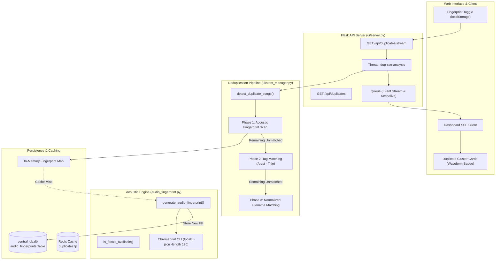

# 🔊 Audio Fingerprinting in Android Music Sync

## Executive Summary

In **Android Music Sync**, audio fingerprinting is an acoustic duplicate detection subsystem designed to identify duplicate tracks across local music repositories regardless of differences in **file formats** (`.mp3`, `.m4a`, `.flac`, `.opus`, `.ogg`), **bitrates**, **ID3 tag metadata**, or **filenames**.

Standard deduplication approaches rely on filename hashing or ID3 tag comparisons (`Artist - Title`). These methods fail when:
- A track is converted from FLAC to MP3 or AAC.
- Files have poor or missing metadata tags (`Track 01.mp3`, `Unknown Artist`).
- YouTube/Spotify downloaders append varying suffixes (e.g. `Song (Official Video) [Lyrics].mp3` vs `01. Song.flac`).

Android Music Sync solves this by integrating **Chromaprint's `fpcalc`** binary with a **persistent SQLite caching engine**, a **multi-phase deduplication cascade**, and **real-time Server-Sent Events (SSE)** in the Web Dashboard.

---

## High-Level Architecture



---

## Obsidian Note Index (MOC)

The audio fingerprinting documentation is split into specialized modular notes. Explore each topic below:

| Note | Focus Area | Key Concepts |
| :--- | :--- | :--- |
| **[[Chromaprint & fpcalc Integration]]** | Low-level acoustic hashing | Perceptual audio hashing, `fpcalc` binary, CLI parameters, `audio_fingerprint.py` module |
| **[[Fingerprint Cache & Database Schema]]** | Persistence & Optimization | SQLite `audio_fingerprints` table, mtime/size validation, in-memory map preloading |
| **[[Multi-Phase Duplicate Detection Engine]]** | Algorithmic pipeline | 3-Phase cascade (Waveform $\rightarrow$ ID3 Tags $\rightarrow$ Filename), cluster naming heuristics, graceful degradation |
| **[[Web UI & Real-Time SSE Streaming]]** | Frontend & API integration | Server-Sent Events (`/api/duplicates/stream`), live progress logging, cluster cards, auto-selection |

---

## Technical Specifications Summary

| Feature | Implementation Detail |
| :--- | :--- |
| **Underlying Technology** | [Chromaprint](https://acoustid.org/chromaprint) (`fpcalc`) by AcoustID |
| **Python Wrapper** | [`audio_fingerprint.py`](file:///Users/aruncs/Desktop/Projects/Android_Music_Sync/audio_fingerprint.py) |
| **Analysis Length** | First 120 seconds of audio (`-length 120`) |
| **Process Timeout** | 20 seconds per track execution limit |
| **Database Table** | `audio_fingerprints` in `database/db.db` |
| **Cache Invalidation** | File size (`st_size`) and modification time (`st_mtime`) verification |
| **Clustering Complexity** | $O(N)$ with SQLite/in-memory hash grouping |
| **Web API Endpoints** | `GET /api/duplicates?fingerprint=true`, `GET /api/duplicates/stream?fingerprint=true` |
| **UI Integration** | HTML5 Dashboard toggle, live SSE progress console, acoustic waveform badge |

---

## Quick Testing & Verification

To verify that audio fingerprinting and `fpcalc` are functional on your system:

```bash
# 1. Check fpcalc availability via CLI
which fpcalc

# 2. Test fingerprint generation manually on an audio file
fpcalc -json -length 120 "/path/to/song.mp3"

# 3. Run the automated fingerprint test suite
pytest tests/test_audio_fingerprint.py -v
```

---

## Related Project Notes
- Main Project Documentation: **[[Android Music Sync]]**
- Repository README: **[README.md](README.md)**
