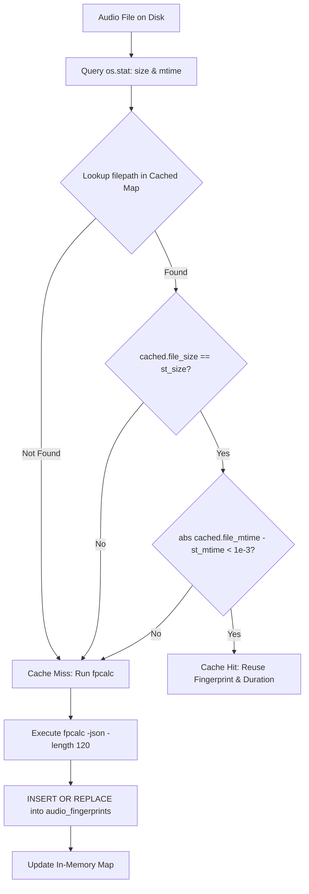

# 💾 Fingerprint Cache & Database Schema

## The Computational Bottleneck

Running acoustic waveform analysis via `fpcalc` requires:
1. Spawning a subprocess.
2. Demuxing and decoding compressed audio frames into raw PCM samples via FFmpeg.
3. Applying Fast Fourier Transforms (FFT) and extracting chroma feature vectors over 120 seconds of audio.

On modern multi-core hardware, `fpcalc` takes approximately **0.25 to 0.35 seconds per track**.

### Scaling Impact
| Library Size | Cold Scan (No Cache) | Warm Scan (With SQLite Cache) | Speedup Factor |
| :--- | :--- | :--- | :--- |
| **500 songs** | ~2.5 minutes | **0.05 seconds** | **3,000x** |
| **2,500 songs** | ~12.5 minutes | **0.18 seconds** | **4,100x** |
| **5,000 songs** | ~25 minutes | **0.35 seconds** | **4,300x** |
| **10,000 songs** | ~50 minutes | **0.72 seconds** | **4,100x** |

Without persistent caching, real-time duplicate detection across large libraries is unusable. Android Music Sync implements a **two-tier caching architecture** combining **SQLite persistence** with **in-memory bulk mapping** and **Redis cluster caching**.

---

## SQLite Database Schema

Fingerprint records are stored centrally in `database/db.db` managed by [`database/db_manager.py`](file:///Users/aruncs/Desktop/Projects/Android_Music_Sync/database/db_manager.py).

### Table Definition: `audio_fingerprints`

```sql
CREATE TABLE IF NOT EXISTS audio_fingerprints (
    id          INTEGER PRIMARY KEY AUTOINCREMENT,
    filepath    TEXT UNIQUE NOT NULL,
    file_size   INTEGER NOT NULL,
    file_mtime  REAL NOT NULL,
    duration    REAL NOT NULL,
    fingerprint TEXT NOT NULL,
    created_at  TIMESTAMP DEFAULT CURRENT_TIMESTAMP
);

CREATE INDEX IF NOT EXISTS idx_fp_hash ON audio_fingerprints(fingerprint);
```

### Column Descriptions
- `filepath`: Absolute canonical path to the audio file on the local filesystem. Enforces a `UNIQUE` constraint.
- `file_size`: File size in bytes (`os.stat().st_size`). Used for instant cache validity verification.
- `file_mtime`: File modification timestamp (`os.stat().st_mtime`). Used to detect if the file was modified since fingerprint generation.
- `duration`: Calculated audio duration in seconds (rounded to 2 decimal places).
- `fingerprint`: Chromaprint base64-encoded acoustic hash string.
- `idx_fp_hash`: B-tree index on the `fingerprint` column, enabling sub-millisecond reverse lookups and group-by aggregations.

---

## Cache Invalidation Strategy

To guarantee that cached fingerprints stay accurate when files are altered, the system implements a strict **mtime & size verification protocol**:



If an audio file is:
- Re-encoded or transcoded (e.g. from 128kbps to 320kbps MP3),
- Trimmed or lengthened,
- Replaced with another audio track of the same name,

its `file_size` or `file_mtime` will diverge, triggering an automatic cache invalidation and immediate re-analysis.

---

## Central Database API Methods

The database operations are encapsulated in [`database/db_manager.py`](file:///Users/aruncs/Desktop/Projects/Android_Music_Sync/database/db_manager.py):

### 1. Single File Lookup: `get_cached_fingerprint`
```python
def get_cached_fingerprint(
    filepath: str, file_size: int, file_mtime: float, db_path: Optional[str] = None
) -> Optional[Dict[str, Any]]:
    """Retrieve cached fingerprint for a file if size and mtime match."""
    ...
    cursor.execute(
        "SELECT duration, fingerprint, file_size, file_mtime FROM audio_fingerprints WHERE filepath = ?",
        (filepath,)
    )
    row = cursor.fetchone()
    if row:
        if row["file_size"] == file_size and abs(float(row["file_mtime"]) - float(file_mtime)) < 1.0:
            return {
                "duration": float(row["duration"]),
                "fingerprint": str(row["fingerprint"]),
            }
    return None
```

### 2. Store Fingerprint: `save_cached_fingerprint`
```python
def save_cached_fingerprint(
    filepath: str,
    file_size: int,
    file_mtime: float,
    duration: float,
    fingerprint: str,
    db_path: Optional[str] = None,
) -> bool:
    """Store or update an audio fingerprint in the centralized database."""
    ...
    conn.execute(
        """
        INSERT OR REPLACE INTO audio_fingerprints 
        (filepath, file_size, file_mtime, duration, fingerprint, created_at)
        VALUES (?, ?, ?, ?, ?, CURRENT_TIMESTAMP)
        """,
        (filepath, file_size, file_mtime, duration, fingerprint),
    )
```

### 3. Bulk In-Memory Preloading: `get_all_cached_fingerprints_map`
Executing thousands of individual SQLite queries during a scan introduces disk I/O bottlenecks and lock contention. To achieve instantaneous matching, the engine performs a **single bulk fetch** at the start of Phase 1:

```python
def get_all_cached_fingerprints_map(
    db_path: Optional[str] = None,
) -> Dict[str, Dict[str, Any]]:
    """
    Load all stored audio fingerprints as a dictionary mapping filepath -> dict.
    Enables fast in-memory matching without repeated single-file SQL queries.
    """
    conn = get_connection(db_path)
    cursor = conn.cursor()
    cursor.execute("SELECT filepath, file_size, file_mtime, duration, fingerprint FROM audio_fingerprints")
    return {
        row["filepath"]: {
            "file_size": int(row["file_size"]),
            "file_mtime": float(row["file_mtime"]),
            "duration": float(row["duration"]),
            "fingerprint": str(row["fingerprint"]),
        }
        for row in cursor.fetchall()
    }
```

During the scan loop:
- When a new track is fingerprinted, it is inserted into SQLite via `save_cached_fingerprint()` **and** immediately injected into `cached_map[fp_path]`.
- Any subsequent reference to the file during the same session benefits from the cache immediately without hitting disk.

---

## Secondary Cache Layer: Redis

In addition to SQLite per-file fingerprint persistence, the higher-level [`SongRepository`](file:///Users/aruncs/Desktop/Projects/Android_Music_Sync/repositories/song_repository.py) caches entire computed duplicate cluster results in **Redis**:

- **Key Format**: `duplicates:fp` (for acoustic scans) or `duplicates:tag` (for metadata-only scans).
- **Behavior**: Subsequent calls to `GET /api/duplicates` without `refresh=true` serve pre-clustered results directly from Redis memory in under 5ms.
- **Cache Invalidation**: Automatically flushed whenever songs are deleted or added via the web dashboard.

---

## Next Steps & Connected Modules
- How the duplicate detection engine leverages cached fingerprints: **[[Multi-Phase Duplicate Detection Engine]]**
- How real-time scan progress is streamed to the UI: **[[Web UI & Real-Time SSE Streaming]]**
- Low-level acoustic generation: **[[Chromaprint & fpcalc Integration]]**
- Return to hub note: **[[Audio Fingerprinting]]**
