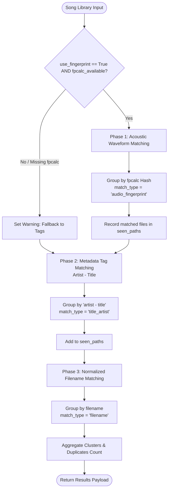

# ⚙️ Multi-Phase Duplicate Detection Engine

## Overview

The duplicate detection engine in **Android Music Sync** is implemented in [`ui/stats_manager.py`](file:///Users/aruncs/Desktop/Projects/Android_Music_Sync/ui/stats_manager.py) inside `detect_duplicate_songs()`. 

To maximize detection accuracy while preventing false positives and duplicate cluster overlaps, the engine executes a **3-phase cascading pipeline**:



---

## The 3-Phase Cascading Architecture

### Phase 1: Acoustic Fingerprint Matching
*Active when `use_fingerprint=True` and `is_fpcalc_available()=True`.*

1. **Preloading Cache**: Fetches all existing fingerprints from SQLite into an in-memory dictionary via `central_db.get_all_cached_fingerprints_map()` (see **[[Fingerprint Cache & Database Schema]]**).
2. **Per-Song Evaluation**:
   - Queries `os.stat()` for `st_size` and `st_mtime`.
   - On cache hit: reuses pre-computed fingerprint without invoking external processes.
   - On cache miss: executes `audio_fingerprint.generate_audio_fingerprint()` via `fpcalc` (see **[[Chromaprint & fpcalc Integration]]**), stores result into SQLite, and registers it in memory.
3. **Bucket Grouping**: Accumulates matching files into `by_fingerprint[fp]`.
4. **Cluster Formation**:
   - Identifies buckets with more than 1 song (`len(song_group) > 1`) and distinct paths (`len(cluster_paths) > 1`).
   - Assigns `match_type: "audio_fingerprint"`.
   - Adds all clustered filepaths to `seen_paths`.

### Phase 2: Metadata Tag Matching (`Artist - Title`)
*Evaluates songs that were not clustered in Phase 1 (i.e. `filepath not in seen_paths`).*

1. **Key Normalization**: Extracts ID3/FLAC metadata tags:
   - `title = (song.get("title") or "").strip().lower()`
   - `artist = (song.get("artist") or "").strip().lower()`
   - Composite key: `"{artist} - {title}"` (or `{title}` if artist is empty or `"unknown"`).
2. **Filtering**: Ignores empty or `"unknown"` titles.
3. **Cluster Formation**:
   - Groups remaining tracks with matching metadata keys.
   - Verifies that the cluster is not already a subset of `seen_paths`.
   - Assigns `match_type: "title_artist"`.
   - Updates `seen_paths` with the newly matched files.

### Phase 3: Normalized Filename Matching
*Catches remaining duplicates that have corrupt/missing tags and differing acoustic prefixes (e.g. tracks with extra leading silence).*

1. **Filename Extraction**: Normalizes `(song.get("filename") or os.path.basename(path)).strip().lower()`.
2. **Cluster Formation**:
   - Groups tracks by exact normalized filename.
   - Verifies paths are not subsets of `seen_paths`.
   - Assigns `match_type: "filename"`.
   - Updates `seen_paths`.

---

## Intelligent Cluster Naming Heuristics

When songs are grouped acoustically, their filenames and tags may differ drastically (e.g. `Track 01.mp3` vs `Led Zeppelin - Stairway to Heaven.flac`). The engine applies a hierarchy to generate clear, human-readable cluster titles:

```python
cluster_name = None
for s in song_group:
    t = (s.get("title") or "").strip()
    a = (s.get("artist") or "").strip()
    if t and t.lower() != "unknown":
        cluster_name = f"{a} - {t}" if a and a.lower() != "unknown" else t
        break

if not cluster_name:
    cluster_name = song_group[0].get("filename") or os.path.basename(
        song_group[0].get("filepath", "Audio Track")
    )

cname = cluster_name.title() if cluster_name else "Acoustic Duplicate Cluster"
```

1. **Top Priority**: First track in the cluster with non-empty, non-`unknown` Artist and Title ID3 tags.
2. **Second Priority**: First track with a valid Title ID3 tag.
3. **Third Priority**: Clean filename of the first track.
4. **Fallback**: `"Acoustic Duplicate Cluster"`.

---

## Graceful Degradation & Fallback

If a user enables acoustic fingerprinting on a system where `fpcalc` is missing from `$PATH`:

1. `audio_fingerprint.is_fpcalc_available()` returns `False`.
2. The engine generates a user-facing warning:
   ```python
   warning = "Acoustic fingerprinting utility ('fpcalc') is not installed on this system. Falling back to tag & filename matching."
   ```
3. An SSE warning event is emitted: `[WARN] fpcalc not found — falling back to tag & filename matching`.
4. The scanner automatically forces `use_fingerprint = False` and runs Phase 2 and Phase 3 without halting or throwing errors.
5. The warning message is passed in the response payload to display an informative alert banner in the web UI.

---

## Data Structure: Return Payload

The function `detect_duplicate_songs()` produces a structured dictionary:

```python
{
    "total_duplicates": 14,      # Total redundant files (sum of len(songs)-1 per cluster)
    "cluster_count": 6,          # Number of unique duplicate clusters
    "fpcalc_available": True,    # Host capability flag
    "warning": None,             # Warning message if fallback occurred
    "clusters": [
        {
            "cluster_name": "Pink Floyd - Comfortably Numb",
            "match_type": "audio_fingerprint",  # "audio_fingerprint" | "title_artist" | "filename"
            "count": 3,
            "songs": [
                {
                    "filepath": "/home/aruncs/Music/Pink Floyd/Comfortably Numb.flac",
                    "filename": "Comfortably Numb.flac",
                    "artist": "Pink Floyd",
                    "title": "Comfortably Numb",
                    "bitrate": 980,
                    "audio_fingerprint": "AQAAUImUREmWJEqSH...",
                    "audio_duration": 382.4
                },
                {
                    "filepath": "/home/aruncs/Music/Downloads/06 Track.mp3",
                    "filename": "06 Track.mp3",
                    "artist": "Unknown",
                    "title": "Track 06",
                    "bitrate": 320,
                    "audio_fingerprint": "AQAAUImUREmWJEqSH...",
                    "audio_duration": 382.4
                }
            ]
        }
    ]
}
```

---

## Duplicate Resolution: "Keep Best" Strategy

Once clusters are identified, the Web Dashboard provides an intelligent **"Auto-select (Keep Best)"** algorithm (`findKeeperInCluster` in `dashboard.js`):

1. **Bitrate Comparison**: Prefers higher bitrate audio (e.g. 320kbps MP3 vs 128kbps MP3, or Lossless FLAC over Lossy).
2. **Metadata Completeness**: Favors files with populated ID3 tags over untagged files.
3. **File Size**: Prefers higher-fidelity uncompressed versions.
4. **Action**: Automatically marks lower-quality redundant copies for trash disposal while preserving the primary reference copy.

---

## Next Steps & Connected Modules
- Web UI and live Server-Sent Events architecture: **[[Web UI & Real-Time SSE Streaming]]**
- SQLite caching layer details: **[[Fingerprint Cache & Database Schema]]**
- Underlying `fpcalc` binary mechanics: **[[Chromaprint & fpcalc Integration]]**
- Return to hub note: **[[Audio Fingerprinting]]**
