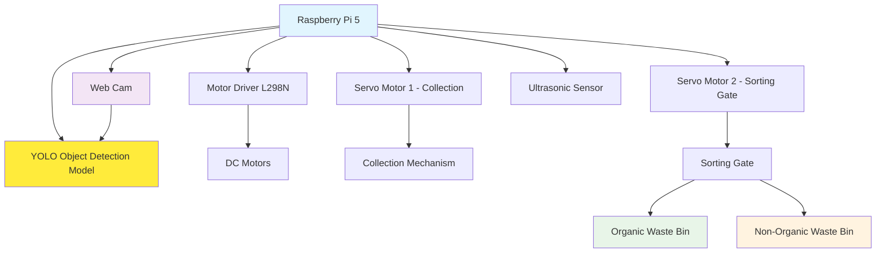
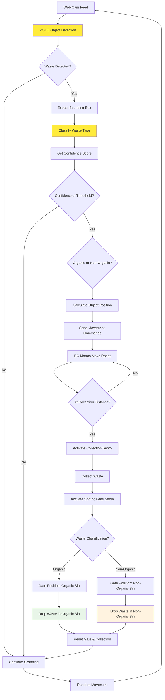

# Pond Water Cleaner And Classifier

- [[Machine Learning]]
- [[Final Presentaion]]
This project involves a waste cleaner placed in a pond, which uses YOLO object detection to identify waste in front, moves towards the detected objects, and separates them using a servo motor. 

## Components Required:
1. Raspberry Pi 5
2. Web Cam
3. Motor Driver(L298N)
4. DC Motors
5. Ultrasonic Sensor (optional, for additional obstacle avoidance)
6. 2x Servo Motors (for dual bin sorting)
7. Organic Waste Bin
8. Non-Organic Waste Bin
9. Sorting Mechanism/Gate

## Components Block Diagram

## System Flow Diagram

