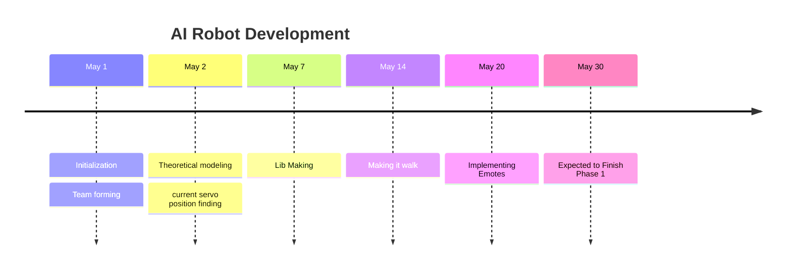

# Development 
- [[Angle table]]
- [[Inverse Kinematics]]
- [[Position Testing]]
There are currently few tasks at hand 
1. Make the Robot Walk 
2. Then add object avoidance
3. Stream Video through webcam and identify persons.
The development have devided into 4 stages( #update ) for the timebeing 

- [[#Development Phase 0]]
- [[#Development Phase 1]] -> making the robot walk 

# Development Phase 0 
**Prerequisites**
- [[Understanding Servos]]

**Tasks**
1. Find initial positions of each servos
	*During the first step it is found that there is some offset about the pulse width.* 
2. Tweak the servos to get the desired angles .
3. Integrate the whole part to the code 

## Intro 

![[Pasted image 20250608200611.png]]

Threre are **17** servos in total , each servo can rotate from **0** to **180** degrees , it was not clear at first that the [[MG995]] can rotate upto angle **180** or not. But later some source like [this](https://components101.com/motors/mg995-servo-motor) show that it is indeed possible to for the [[MG995|servo]] to rotate upto 180.

## 2 PCA9685  as Driver

```cpp
#define SERVO_MIN  125
#define SERVO_MAX  625

```

This is the value of `SERVOMIN` and `SERVOMAX` found in the internet code , now we have to find the value corresponding to our servo.
We know the [[PCA9685]] has a `12bit` **PWM** 
$$
\text{12 bit adc} = 2^{12} = 4096 \text{ levels}
$$

the [[MG995]] has the following PWM  feature ![[MG995#^17d14e]]  
$$
\text{50 Hz} \to \frac{1}{50} \to 20\text{ ms}
$$
$$
20 ms \to \frac{20}{4096} \to 4.88\mu s
$$
![[MG995#^90bc64]]

$$
0.5ms \to \frac{0.5 ms}{4.88\mu s } \to 102.45
$$
$$
1.5ms \to \frac{1.5 ms}{4.88\mu s } \to 102.45 \times 3 = 307
$$
$$
2.5ms \to \frac{2.5 ms}{4.88\mu s } \to 102.45 \times 5 = 512
$$
*now the new code will become*

```cpp
#define SERVO_MIN  102
#define SERVO_MAX  512
#define SERVO_FREQ 50
#define SERVO_ANGLE_MIN 0
#define SERVO_ANGLE_MAX 180

```

Servoo

```cpp
void setup() {
  board1.setPWMFreq(SERVO_FREQ);
}

```

```cpp
uint16_t get_pulse(uint8_t _angle){
 return map(_angle,SERVO_ANGLE_MIN, SERVO_ANGLE_MAX, SERVO_MIN,SERVO_MAX);
  }

```

**Usage**

```cpp
#define I2C_ADDR 0x40 
Adafruit_PWMServoDriver the_servo = Adafruit_PWMServoDriver(I2C_ADDR);
 #define /* let*/ first_pin /* of pca9685 */ = 0 ;

for(uint8_t angle = 0 ; angle < ANGLE_MAX ; angle++){
	the_servo.setPWM(first_pin , 0,get_pulse(angle));
}

```

### 2.1 Pin Defenitions
The [[PCA9685]] has 16 output pins, but the thing is our robot has 17 servos so im going to use additional [[PCA9685]] or a dedicated pin(15) for the last servo(head )

| Pin Name | Unit       | Value |
| -------- | ---------- | ----- |
| PIN_LA1  | Left arm   | 0     |
| PIN_LA2  | Left arm   | 1     |
| PIN_LA3  | Left arm   | 2     |
| PIN_RA1  | Right arm  | 3     |
| PIN_RA2  | Right arm  | 4     |
| PIN_RA3  | Right arm  | 5     |
| PIN_LH   | Left Hip   | 6     |
| PIN_RH   | Right Hip  | 7     |
| PIN_LL1  | Left Leg   | 8     |
| PIN_LL2  | Left Leg   | 9     |
| PIN_LL3  | Left Leg   | 10    |
| PIN_RL1  | Right Leg  | 11    |
| PIN_RL2  | Right Leg  | 12    |
| PIN_RL3  | Right Leg  | 13    |
| PIN_LF   | Left Foot  | 14    |
| PIN_RF   | Right Foot | 15    |

^c18f43

```cpp
#define PIN_LA1 0
#define PIN_LA2 1
#define PIN_LA3 2
#define PIN_RA1 3
#define PIN_RA2 4
#define PIN_RA3 5
#define PIN_B1 6
#define PIN_B2 7
#define PIN_LL1 8
#define PIN_LL2 9
#define PIN_LL3 10
#define PIN_RL1 11
#define PIN_RL2 12
#define PIN_RL3 13
#define PIN_LF 14
#define PIN_RF 15

```

^d85d2b

## 3 Finding the initial position of all servos 
 
$$
\text{let }\theta_{o}  = \text{Initial Position }
$$
**Initial position** in the sense that  the position of the servo when the robot is in the standing position 

### 3.1 Initial Positions 

$$
\begin{align}
\theta_{0}& \to \text{Initial Posiotion} \\
\end{align}
$$

```cpp
// Servo Vals.h
#define SERVO_ANGLE_MIN 0
#define SERVO_ANGLE_MAX 5000
#define SERVO_MIN  102   // .5ms
#define SERVO_MAX  512   // 2.5ms 
#define SERVO_FREQ 50

```

### Tests

```dataview
TABLE servo as "ID", pin as "pin" , initial_position as "Initial Angle",  status as "Status" , rotation as "Rotation"
WHERE file = this.file 

```

**pulse tester**

```python
import requests 
url = "http://192.168.137.142/setServo"
def set_position(val,id=0):
	req_params= {
		"id": id,
		"position": val
		}
	response = requests.get(url, params=req_params)
	print(f"Response: {response.text}")
while True:
	val = int(input("Enter position"))
	set_position(val)
	
	if val == 0:
		break;

```

**angle tester**

```python
import requests 
url="http://192.168.248.254/setServo"
import time

```

```python
def get_pulse(val):
	return val * (512 - 102 ) /180 + 102 
def set_position(val,id=0):
	req_params= {
		"id": id,
		"angle": val
		}
	response = requests.get(url, params=req_params)
	print(f"Response: {response.text}")

```

```python
while True:
	for i in range(0,180):
		new_val = get_pulse(i)
		set_position(new_val,id=1)
		time.sleep(.1)
	for i in range(180,1):
		new_val = get_pulse(i)
		set_position(new_val,id=1)
		time.sleep(.1)
		

```

```python
while True:
	val = int(input("Enter position"))
	if val == 1000:
		break;
	new_val = get_pulse(val)
	set_position(new_val,id=1)
	

```

```python
new_val = 180
set_position(new_val,id=0)

```

```python
LL1=0
LL2=10 
LL3=180-39 
RL1=180
RL2=170
RL3=39
RF=99
LF=99

```

```python 
import time 
set_position(get_pulse(LL1),id=8) # LL1 
time.sleep(1)
set_position(get_pulse(LL2),id=9) # LL2 
time.sleep(1)
set_position(get_pulse(LL3),id=10) # LL3 
time.sleep(1)
set_position(get_pulse(RL1),id=11) # RL1 
time.sleep(1)
set_position(get_pulse(RL2),id=12) # RL2 
time.sleep(1)
set_position(get_pulse(RL3),id=13) # RL3
time.sleep(1)
set_position(get_pulse(LF),id=14) # LF 
time.sleep(1)
set_position(get_pulse(RF),id=15) # RF 

```

```python 
set_position(160,id=12) # RL2 

```

**ideal**

```python
id = 5
zero_degree = {
	"id": id,
	"position": 102
}
one80_degree = {
	"id": id,
	"position": 522
}

```

**min**

```python
response = requests.get(url, params=zero_degree)
print(f"Response: {response.text}")

```

**max**

```python
response = requests.get(url, params=one80_degree)
print(f"Response: {response.text}")

```

### Upper Body

![[Pasted image 20250608202240.png]]

####  1. LA1 
- [servo:: LA1]
- [pin:: 0]
- [initial_position:: 25]
- [status:: fine]
![[Pasted image 20250608024100.png]]
- Orientation X -> Z , Z -> -X 
- Current [orientation:: $I \to R_{y}(90)$]
$$
\begin{bmatrix}
1 & 0 & 0  \\
0 & 1 & 0 \\
0 & 0 & 1 
\end{bmatrix} \to 
\begin{bmatrix}
0 & 0 & 1  \\
0 & 1 & 0 \\
-1 & 0 & 0  \\
\end{bmatrix}
$$
- serv[rotation:: $R_{-x}(\theta)$]

#### 2. LA2 
- [servo:: LA2]
- [pin:: 1]
- [initial_position:: 10]
- [status:: not fine]
#### 3. LA3 
- [servo:: LA3]
- [pin:: 2]
- - [initial_position:: 160]
- [status:: fine]

#### 4. RA1 

- [pin:: 3] 
- [servo:: RA1]
- [initial_position:: 160]
- The orientation of the servo is changed (z -> x and X -> -Z)

$$
\begin{bmatrix}
1 & 0 & 0  \\
0 & 1 & 0 \\
0 & 0 & 1 
\end{bmatrix} \to 
\begin{bmatrix}
0 & 0 & -1  \\
0 & 1 & 0 \\
1 & 0 & 0  \\
\end{bmatrix}
$$
- [status:: fine]
- [rotation:: $R_{x}(\theta)$]
#### 5. RA2 

- [servo:: RA2]
- [pin:: 4]
- [initial_position:: 160]
- [status:: not fine]
- [rotation:: $R_{z}(\theta)$]
#### 6. RA3
- [servo:: RA3]
- [pin:: 5]
- [initial_position:: 30]
- [status:: fine]

### Lower Body

#### 7. LH
- [servo:: LH]
- [pin:: 6]
- [initial_position:: 102]
- [status:: fine]
- [rotation:: $R_{z}(\theta)$]
- Current [orientation:: $I \to R_{z}(90)$]

$$
\begin{bmatrix}
1 & 0 & 0  \\
0 & 1 & 0 \\
0 & 0 & 1 
\end{bmatrix} \to 
\begin{bmatrix}
0 &-1 & 0  \\
1 & 0 & 0 \\
0 & 0 & 1  \\
\end{bmatrix}
$$

#### 8. RH
- [servo:: RH]
- [pin:: 7]
- [initial_position:: 102]
- [status:: fine]
- [rotation:: $R_{z}(\theta)$]
- Current [orientation:: $I \to R_{z}(-90)$]
$$
\begin{bmatrix}
1 & 0 & 0  \\
0 & 1 & 0 \\
0 & 0 & 1 
\end{bmatrix} \to 
\begin{bmatrix}
0 &1 & 0  \\
-1 & 0 & 0 \\
0 & 0 & 1  \\
\end{bmatrix}
$$

#### 9. LL1
- [servo:: LL1]
- [pin:: 8]
- [initial_position:: 25]
- [status:: fine]
- [rotation:: $R_{-x}(\theta)$]
- Current [orientation:: $I \to R_{y}(90)$]

$$
\begin{bmatrix}
1 & 0 & 0  \\
0 & 1 & 0 \\
0 & 0 & 1 
\end{bmatrix} \to 
\begin{bmatrix}
0 & 0 & -1  \\
0 & 1 & 0 \\
1 & 0 & 0  \\
\end{bmatrix}
$$

#### 10. LL2
- [servo:: LL2]
- [pin:: 9]
- [initial_position:: 25]
- [status:: fine]
- [rotation:: $R_{-x}(\theta)$]
- Current [orientation:: $I \to R_{z}(-90) \to R_{x}(180)$] 

$$
\begin{bmatrix}
1 & 0 & 0  \\
0 & 1 & 0 \\
0 & 0 & 1 
\end{bmatrix} \to 
\begin{bmatrix}
0 & 0 & -1  \\
0 & 1 & 0 \\
1 & 0 & 0  \\
\end{bmatrix}
\to
\begin{bmatrix}
 0& 0 & -1  \\
0 & -1 & 0 \\
-1 & 0 & 0  \\
\end{bmatrix}
$$

1. First Initial position of Servo 

$$
I = \begin{bmatrix}
1 & 0 & 0 \\
0 & 1 & 0  \\
0 & 0 & 1
\end{bmatrix}
$$
2.  Rotate 90° Around the Y-Axis $Z \to -X$ (**global axis**)
According to ![[Rotations#^36e3d2]]
$$
= \begin{bmatrix}
0 & 0 & 1 \\
0 & 1 & 0  \\
-1 & 0 & 0
\end{bmatrix}
$$

3. 180° Around the X-Axis (Flips Y and Z Down)  (**global axis**)

$$
= \begin{bmatrix}
0 & 0 & 1 \\
0 & 1 & 0  \\
-1 & 0 & 0
\end{bmatrix} \cdot 
\begin{bmatrix}
1 & 0 & 0 \\
0 & \cos (180) & -\sin (180) \\
0 & \sin (180) & \cos (180)
\end{bmatrix} = \begin{bmatrix}
0 & 0 & 1 \\
0 & 1 & 0  \\
-1 & 0 & 0
\end{bmatrix} \cdot  
\begin{bmatrix}
1 & 0 & 0 \\
0 & -1 & 0 \\
0 & 0 & -1
\end{bmatrix} = \begin{bmatrix}
0 & 0 & -1 \\
0 & -1 & 0 \\
-1 & 0 & 0
\end{bmatrix}
$$

#### 11. LL3
- [servo:: LL3]
- [pin:: 10]
- [initial_position:: 160]
- [status:: fine]
- [rotation:: $R_{-x}(\theta)$]
- current [orientation:: $I \to R_{y}(90) \to R_{x}(90)$]
$$
\begin{bmatrix}
1 & 0 & 0  \\
0 & 1 & 0 \\
0 & 0 & 1 
\end{bmatrix} \to 
\begin{bmatrix}
0 & 0 & 1  \\
0 & 1 & 0 \\
-1 & 0 & 0  \\
\end{bmatrix}
\to
\begin{bmatrix}
0 & 1 & 0  \\
0 & 0 & -1 \\
-1 & 0 & 0  \\
\end{bmatrix}
$$

#### 12. RL1 
- [servo:: RL3]
- [pin:: 11]
- [initial_position:: 160]
- [status:: fine]
- [rotation:: $R_{x}(\theta)$]

$$
\begin{bmatrix}
1 & 0 & 0  \\
0 & 1 & 0 \\
0 & 0 & 1 
\end{bmatrix} \to 
\begin{bmatrix}
0 & 0 & 1  \\
0 & 1 & 0 \\
1 & 0 & 0  \\
\end{bmatrix}
$$

#### 13. RL2
- [pin:: 12] 
- [servo:: RL2]
- [initial_position:: 165]
- [status:: fine]
- [rotation:: ]
## 4 Movements
Lets say we want to go from position **a** to **b**. the code will be like this

```cpp
for (pos= _initial_position; ++pos; pos < _final_position){
            _servo_obj.setPWM(_this_servo_, 0, angleToPulse(pos));
            delay(DELAY_MS);
        }

```

1. fist sets the position(`pos`) os the starting position(`_initial_position`)
2. writes(`_servo_obj.setPWM(_this_servo , 0 , angleToPulse(pos))`) 
	1. Calculates the current pulseWidth which is respected to the angle
	2. writes that to the servo.
3. introduces some relay to make the movement smoother and reduces surge current

Here few things to consider 
1. `_final_position` is will be greater than `_initial_position` (**_final_position > _initial_position**) 

### 4.1 Raising Hand

>[!blank|right-small]
>![[(output003)Model3ServoArm_trans_2.mp4]]

In this project , rasising hand is the simplest task, because it only involves moving only one servo `LA1`. 
Now consider the following code again. 
![[#^d90f88]]
This code is for [[#clock wise movement]] , in section [[#2 Finding the initial position of all servos]] and the table 

![[#^b7c9fb]]

For the time beeing consider only `LA1` , `LA2` , `LA3` 

| Servo | Unit     | Position Degrees | 180      |
| ----- | -------- | ---------------- | -------- |
| LA1   | Left arm | 25               | to front |
| LA2   | Left arm | 0                | to up    |
| LA3   | Left arm | 16               | to up    |

#### 4.1.1 Left Arm 

```python
import numpy as np
import matplotlib.pyplot as plt
arm_length = 1  
angles_deg = np.linspace(0, 180, 180) 
angles_rad = np.radians(angles_deg)
x = arm_length * np.cos(angles_rad)
y = arm_length * np.sin(angles_rad)
plt.figure(figsize=(6, 3))
plt.plot(x, y, label='Arm Tip Path', color='blue')
plt.plot([0, x[0]], [0, y[0]], 'r--', label='Start Position')   
plt.plot([0, x[-1]], [0, y[-1]], 'g--', label='End Position')  
plt.gca().set_aspect('equal')
plt.title('Servo Arm Sweep 0° to 180°')
plt.xlabel('X (cm)')
plt.ylabel('Y (cm)')
plt.legend()
plt.grid(True)
plt.show()

```

```python
import numpy as np
import matplotlib.pyplot as plt

# Link lengths (both 1 cm)
L1 = 1.0
L2 = 1.0

# Generate angle combinations
theta1_deg = np.linspace(0, 180, 100)
theta2_deg = np.linspace(0, 180, 100)

theta1_rad = np.radians(theta1_deg)
theta2_rad = np.radians(theta2_deg)

# Meshgrid to compute all combinations of joint angles
T1, T2 = np.meshgrid(theta1_rad, theta2_rad)

# Forward kinematics for 2-link planar arm
# Base -> First Joint (L1) -> Second Joint (L2)
X = L1 * np.cos(T1) + L2 * np.cos(T1 + T2)
Y = L1 * np.sin(T1) + L2 * np.sin(T1 + T2)

# Plot
plt.figure(figsize=(6, 6))
plt.scatter(X, Y, s=1, c='blue')
plt.title("Reachable Workspace of 2-Link Arm")
plt.xlabel("X (cm)")
plt.ylabel("Y (cm)")
plt.axis('equal')
plt.grid(True)
plt.show()

```

$$
i = \begin{bmatrix}
1 & 0  \\
0 & 1
\end{bmatrix}
$$
## 5 Timeline



## 6 References

- [ ] Need to checkout this [link](https://forum.arduino.cc/t/varspeedservo-a-modified-servo-library-with-speed-control/61404/5)
1. https://www.instructables.com/Making-humanoid-robot-from-Flated-water-pipe-and-s/
2. https://projecthub.arduino.cc/ashraf_minhaj/mia-1-open-source-advanced-handmade-humanoid-robot-36429e
3. https://github.com/AndreiBuzdugan/Little-Human-Robot/blob/main/Ultrasonic_Robot.ino
4. https://github.com/hubonit/Humanoid-Robot-with-Arduino
5. https://github.com/hubonit/Humanoid-Robot-with-Arduino/blob/master/GBotV3.ino
6. https://github.com/gunarakulangunaretnam/mr-humanoid
7. https://docs.manim.community/en/stable/
8. https://gemini.google.com/app/2b0e2c2787d08884?hl=en-IN

### ROS Projects
1. https://www.makr.org/2021/scorpio
2. 
