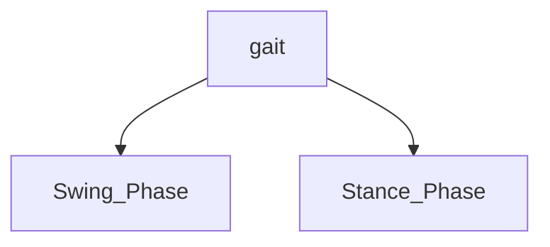

# Walking

The key to walking is to adjust the center of mass.

- servo torque limits?
  `

```cpp
void WalkForward(){
}

```

## Human Walking (Bipedal walking)

![[Walk-Cycle.gif|right]] ^80cec7

**Humanoid walking involves:**

1. Alternating leg movements (gait cycle)
2. Weight shifting between legs
3. Arm swinging for balance
4. Center of gravity management

### 1. The Gait Cycle

![[Pasted image 20250622213556.png]]



#### Stance Phase (60%)

In this the foot is in contact with the ground

- Initial contact (heel strike)
- Loading response (foot flat)
- Mid-stance
- Terminal stance (heel off)
- Pre-swing (toe off)

#### Swing Phase (40%)

Foot is not in contact with the ground

- Initial swing
- Mid-swing
- Late swing
  ![[Pasted image 20250622214203.png]]

### 2. Weight Shifting

[Source](https://www.med.umich.edu/1libr/PMR/BalanceExercises/Weight%20Shifting%20-%20Side%20to%20Side.pdf)

![[Pasted image 20250622214408.png]]

### 3. Arm Swing

![[#^80cec7]]

- each arm swings with the motion of the **opposing** leg
- Swinging arms in an opposing direction with respect to the lower limb reduces the angular momentum of the body, balancing the rotational motion produced during walking
- As the walking speed increases, the amplitude of the arm swing increases accordingly.
- **Why**
  the leg swing results in an angular momentum that is balanced by the ground reaction moments on the stance foot. Swinging arms create an angular momentum in the opposing direction of lower limb rotation, reducing the total angular momentum of the body. Lower angular momentum of the body results in a decline on the ground reaction moment on the stance foot

In walking, each arm swinging with the motion of the opposite leg reduces the angular momentum of the body by balancing the rotational motion produced during movement. As the speed of walking increases, the amplitude of arm swings also increases accordingly, resulting in an overall balance between lower and upper limb rotations. This creates a decrease in ground reaction moments on the stanch foot, leading to a reduction in body deceleration and improved stability during walking.

### 4. Center of Gravity Management

Managing Center of Gravity (COG) crucial for maintaining balance and preventing falls. _By positioning the Center of Gravity over the base of support (feet)_

[Source](https://en.egaco.com/11537/)
![[Pasted image 20250622220132.png]]
![[Pasted image 20250622220156.png]]![[Pasted image 20250622220241.png]]
![[Pasted image 20250622220248.png]]

## Robot Walking

We Need to calculate the **Hip** **Knee** and **Ankle** angles for each leg to achieve walking motion.
x, y, z represents foot position relative to the hip joint.

🦵 Has Parts

1. Thigh
2. Shin
3. Foot

Thigh -> it length `thighLength`

1. Calcuate the `legLength`

$$
\text{Leg Lenght} = \sqrt{x^2 + y^2 + z^2}
$$

```cpp
float legLength = sqrt(x*x + y*y + z*z);

```

```cpp
void calculateLegIK(float x, float y, float z, float &hipAngle, float &kneeAngle, float &ankleAngle) {
    // Convert from 3D space to servo angles
    float legLength = sqrt(x*x + y*y + z*z);
    float alpha = acos((thighLength*thighLength + shinLength*shinLength - legLength*legLength) / (2*thighLength*shinLength));
    kneeAngle = 180 - alpha * RAD_TO_DEG;

    float beta = acos((thighLength*thighLength + legLength*legLength - shinLength*shinLength) / (2*thighLength*legLength));
    hipAngle = atan2(x, sqrt(y*y + z*z)) * RAD_TO_DEG + beta * RAD_TO_DEG;

    ankleAngle = atan2(y, z) * RAD_TO_DEG - hipAngle;
}

```

