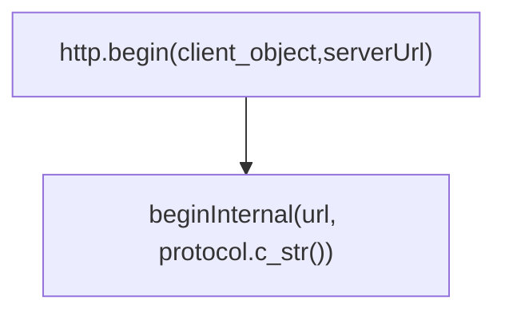

# Robot Database

### Creation

```python
app.config['SQLALCHEMY_DATABASE_URI'] = 'sqlite:///robot_database.db'
app.config['SQLALCHEMY_TRACK_MODIFICATIONS'] = False
db = SQLAlchemy(app)
class Robot(db.Model):
    id = db.Column(db.Integer, primary_key=True)
    name = db.Column(db.String(80), nullable=False)
    last_position = db.Column(db.Integer, nullable=False)
    def to_dict(self):
        return {"id": self.id, "name": self.name, "last_position": self.last_position}

```

##### Create the database tables

```python
with app.app_context():
    db.create_all()

```

# Testing

```bash
curl http://192.168.31.92:5000 -s

```

## Initializing

```bash
curl -sX POST http://192.168.31.92:5000/init

```

## Query all robots

```bash
curl  -s http://192.168.31.92:5000/robots

```

## Update Reading

#### Using **POST**

```bash
curl -sX POST http://192.168.31.92:5000/robots \
-H "Content-Type: application/json" \
-d '{"id": 1, "last_position": 45}'

```

#### Using **PUT** 

```bash
curl -sX PUT http://192.168.31.92:5000/robots/update/1 \
-H "Content-Type: application/json" \
-d '{"last_position": 90}'

```

```bash
i=15
while (($i >= 1))
do 
curl -sX PUT http://192.168.31.92:5000/robots/update/$i \
-H "Content-Type: application/json" \
-d '{"last_position": 90}'
sleep .7
((i--))
done 

```

# ESP32 Connection

```cpp
String httpGETRequest(const char* serverName) {
  WiFiClient client;
  HTTPClient http;
    
  // Your Domain name with URL path or IP address with path
  http.begin(client, serverName);
  
  // Send HTTP GET request
  int httpResponseCode = http.GET();
  
  String payload = "{}"; 
  
  if (httpResponseCode>0) {
    // Serial.print("HTTP Response code: ");
    // Serial.println(httpResponseCode);
    payload = http.getString();
  }
  else {
    Serial.print("Error code: ");
    Serial.println(httpResponseCode);
  }
  // Free resources
  http.end();

  return payload;
}

```

```cpp
http.begin(client,ServerURL);

```



```cpp
bool HTTPClient::begin(WiFiClient &client, String url) {
// Check for http or https and
    return beginInternal(url, protocol.c_str());
}

```

```cpp
bool HTTPClient::beginInternal(String url, const char* expectedProtocol)
{
    log_v("url: %s", url.c_str());

    // check for : (http: or https:
    int index = url.indexOf(':');
    if(index < 0) {
        log_e("failed to parse protocol");
        return false;
    }

    _protocol = url.substring(0, index);
    if (_protocol != expectedProtocol) {
        log_d("unexpected protocol: %s, expected %s", _protocol.c_str(), expectedProtocol);
        return false;
    }

    url.remove(0, (index + 3)); // remove http:// or https://

    index = url.indexOf('/');
    if (index == -1) {
        index = url.length();
        url += '/';
    }
    String host = url.substring(0, index);
    url.remove(0, index); // remove host part

    // get Authorization
    index = host.indexOf('@');
    if(index >= 0) {
        // auth info
        String auth = host.substring(0, index);
        host.remove(0, index + 1); // remove auth part including @
        _base64Authorization = base64::encode(auth);
    }

    // get port
    index = host.indexOf(':');
    String the_host;
    if(index >= 0) {
        the_host = host.substring(0, index); // hostname
        host.remove(0, (index + 1)); // remove hostname + :
        _port = host.toInt(); // get port
    } else {
        the_host = host;
    }
    if(_host != the_host && connected()){
        log_d("switching host from '%s' to '%s'. disconnecting first", _host.c_str(), the_host.c_str());
        _canReuse = false;
        disconnect(true);
    }
    _host = the_host;
    _uri = url;
    log_d("protocol: %s, host: %s port: %d url: %s", _protocol.c_str(), _host.c_str(), _port, _uri.c_str());
    return true;
}

```