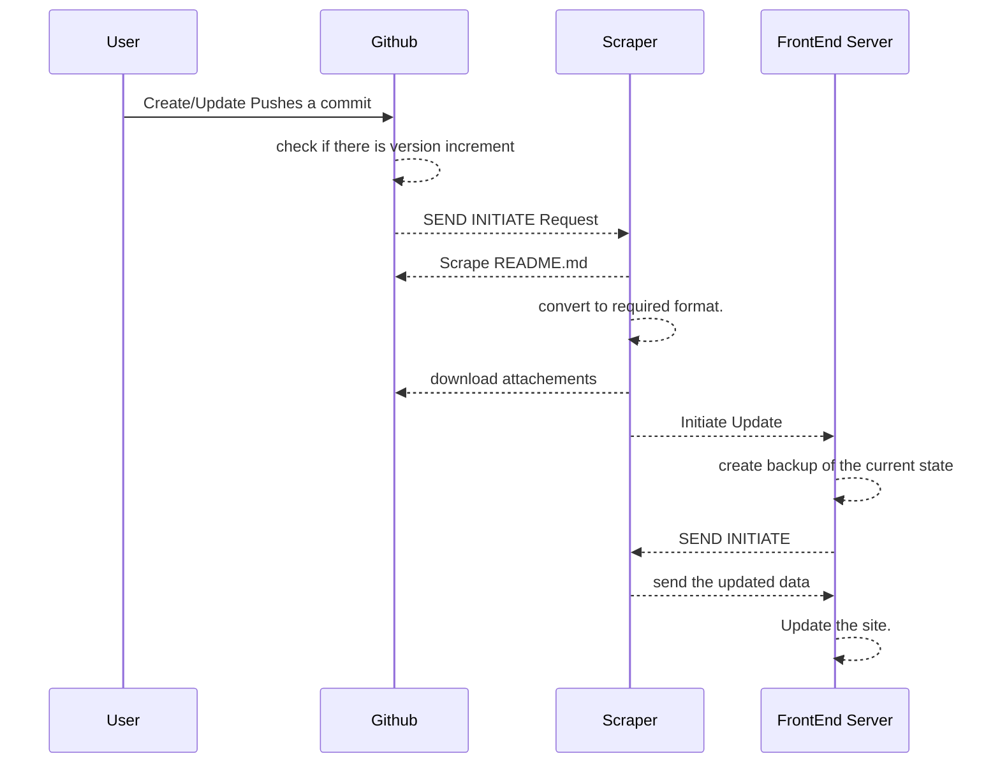

# Github Scraper

> [!check]+ **Things Done**
> - [ ] d

There is now huge confusion in whether i should scrape the `README.md` file or just create a `ci/cd` (`github automation`) pipeline so that , i dont have to do the polling mechanism instead i can just create some form of tocken mechanism and let the `github automation` update each project when an update is pushed.

### Current mechanism 

![[Pasted image 20250710015226.png]]

## Scraping Github 

