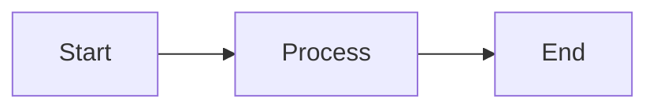

# Contributing to Project Notes

Thank you for your interest in contributing! This document provides guidelines for adding new projects and improving existing documentation.

## Table of Contents

1. [Getting Started](#getting-started)
2. [Adding a New Project](#adding-a-new-project)
3. [Updating Existing Projects](#updating-existing-projects)
4. [Documentation Standards](#documentation-standards)
5. [Pull Request Process](#pull-request-process)
6. [Code of Conduct](#code-of-conduct)

## Getting Started

### Prerequisites

- **For Obsidian Users**: Install [Obsidian](https://obsidian.md/)
- **Recommended Obsidian Plugins**:
  - Dataview (for dynamic queries)
  - Excalidraw (for diagrams)
  - Tasks (for task management)
- **For General Users**: Any Markdown editor

### Setting Up

1. Fork the repository
2. Clone your fork:
   ```bash
   git clone https://github.com/YOUR_USERNAME/Project-Notes.git
   cd Project-Notes
   ```
3. Create a new branch:
   ```bash
   git checkout -b feature/your-project-name
   ```

## Adding a New Project

### 1. Choose the Correct Category

Determine which category your project belongs to:
- `01 Electronics/` - Hardware, embedded systems, IoT
- `02 Web Based/` - Web applications, websites
- `03 Linux/` - Linux configurations, tools
- `04 AI & ML/` - AI and Machine Learning projects
- `05 Robotics/` - Robotics projects
- `06 Others/` - Miscellaneous projects
- `07 Software/` - General software projects

### 2. Create Project Directory

```bash
cd "01 Electronics"  # or appropriate category
mkdir "Your Project Name"
cd "Your Project Name"
```

### 3. Use the Project Template

Create the main documentation file with proper frontmatter:

```markdown
---
id: Your_Project_Name
tags:
  - project
  - electronics  # or appropriate category
dg-publish: true
---

# Your Project Name

## Overview
[Brief description of your project]

## Objectives
- What does this project do?
- What problem does it solve?

## Technical Details
[Architecture, components, tech stack]

## Implementation
[How you built it]

## Results/Testing
[Testing results, performance metrics]

## Challenges & Solutions
[Problems faced and how you solved them]

## Future Improvements
- Enhancement idea 1
- Enhancement idea 2

## Resources
- [Links to references]
```

### 4. Organize Your Files

Follow the recommended structure:
```
Your Project Name/
├── [Project Name].md          # Main documentation
├── attachments/               # Images, diagrams, documents
│   ├── images/
│   ├── diagrams/
│   └── docs/
├── code/                      # Source code (if applicable)
└── versions/                  # Version history (if applicable)
```

See [STRUCTURE.md](STRUCTURE.md) for detailed guidelines.

### 5. Add Proper Tags

Use consistent tags:
- `#project` - Required for all projects
- `#electronics`, `#website`, `#ai`, `#ml`, `#linux`, `#robotics` - Category tags
- Additional descriptive tags as needed

### 6. Update Index Files

After adding your project, update the relevant index file:
- Electronics projects → Update `Electronics Projects.md`
- Web projects → Update `Web Based Projects.md`
- All projects → They'll appear in `Projects.md` automatically via dataview

## Updating Existing Projects

### When to Update

Update existing project documentation when:
- Adding new features or versions
- Fixing errors or clarifications
- Including additional resources
- Documenting lessons learned

### How to Update

1. Navigate to the project directory
2. Make your changes
3. Update the "Last Modified" information if manually tracked
4. If significant changes, consider creating a new version document:
   - Create `versions/Version X.md`
   - Document what changed

### Version Control Best Practices

- Use clear commit messages
- Group related changes together
- Test links and references after updates
- Verify images and diagrams still render correctly

## Documentation Standards

### Writing Style

- **Clear and Concise**: Use simple, direct language
- **Structured**: Use headings and subheadings
- **Visual**: Include diagrams, images, code snippets
- **Complete**: Don't leave sections empty; use "TBD" if needed

### Formatting

#### Headings
```markdown
# Main Title (H1) - Only one per document
## Section (H2)
### Subsection (H3)
#### Sub-subsection (H4)
```

#### Code Blocks
Always specify the language:
````markdown
```python
def example():
    return "Hello World"
```
````

#### Images
```markdown
# For external images


# For Obsidian internal links
![[image.png]]
```

#### Links
```markdown
# External links
[Link Text](https://example.com)

# Internal Obsidian links
[[Another Document]]
[[Another Document|Display Text]]
```

#### Lists
```markdown
# Unordered
- Item 1
- Item 2
  - Sub-item

# Ordered
1. First
2. Second
3. Third

# Task list
- [ ] Todo item
- [x] Completed item
```

### Diagrams

#### Using Excalidraw

1. Create a new Excalidraw file: `diagram-name.excalidraw.md`
2. Draw your diagram
3. Save in the `attachments/diagrams/` directory
4. Embed in your documentation: `![[diagram-name.excalidraw.md]]`

#### Using Mermaid

For inline diagrams, use Mermaid:
````markdown

````

### File Naming

- **Markdown files**: Title Case with spaces
  - Good: `Solar Battery Monitor.md`
  - Bad: `solar_battery_monitor.md`
- **Code files**: Follow language conventions
  - Python: `snake_case.py`
  - JavaScript: `camelCase.js`
  - C/C++: `snake_case.c`
- **Images**: Descriptive, lowercase with hyphens
  - Good: `circuit-diagram-v2.png`
  - Bad: `IMG_1234.png`

## Pull Request Process

### Before Submitting

1. **Review Your Changes**
   ```bash
   git status
   git diff
   ```

2. **Check Documentation**
   - All links work
   - Images render correctly
   - Code blocks have language specified
   - Proper tags are included

3. **Test in Obsidian** (if applicable)
   - Dataview queries work
   - Internal links resolve
   - Embedded content displays

### Submitting

1. **Commit Your Changes**
   ```bash
   git add .
   git commit -m "Add: [Project Name] - Brief description"
   ```
   
   Commit message prefixes:
   - `Add:` - New project or major feature
   - `Update:` - Updates to existing project
   - `Fix:` - Bug fixes or corrections
   - `Docs:` - Documentation-only changes
   - `Refactor:` - Restructuring without changing functionality

2. **Push to Your Fork**
   ```bash
   git push origin feature/your-project-name
   ```

3. **Create Pull Request**
   - Go to the original repository
   - Click "New Pull Request"
   - Select your branch
   - Fill in the PR template:
     - **Title**: Clear, descriptive title
     - **Description**: What you added/changed
     - **Type**: New project, update, fix, etc.
     - **Category**: Electronics, Web, etc.

### PR Review Process

- Maintainers will review your PR
- They may request changes or clarifications
- Address feedback by pushing new commits
- Once approved, your PR will be merged

### After Merging

- Delete your feature branch
- Update your fork:
  ```bash
  git checkout main
  git pull upstream main
  git push origin main
  ```

## Best Practices

### Do's ✅

- Follow the structure guidelines
- Include comprehensive documentation
- Add relevant images and diagrams
- Use proper markdown formatting
- Write clear commit messages
- Link to related projects and resources
- Update index files when adding projects
- Compress large images
- Use descriptive filenames

### Don'ts ❌

- Don't commit sensitive information (passwords, API keys)
- Don't include unnecessary binary files
- Don't leave sections empty without "TBD" markers
- Don't use vague filenames like "image1.png"
- Don't submit incomplete projects without noting WIP status
- Don't break existing links or references
- Don't ignore existing formatting conventions

## Code of Conduct

### Our Standards

- Be respectful and inclusive
- Provide constructive feedback
- Focus on the content, not the person
- Be open to different approaches
- Help others learn and grow

### Unacceptable Behavior

- Harassment or discrimination
- Trolling or inflammatory comments
- Personal attacks
- Publishing others' private information
- Other unprofessional conduct

## Questions or Issues?

If you have questions or need help:
1. Check [STRUCTURE.md](STRUCTURE.md) for detailed guidelines
2. Look at existing projects for examples
3. Open an issue for questions or clarifications
4. Tag maintainers if you need specific help

## Recognition

Contributors will be recognized in:
- Git commit history
- Project documentation (where applicable)
- Future release notes

Thank you for contributing to Project Notes! Your documentation helps others learn and build upon these projects.

---

*Last Updated: 2025-10-23*
