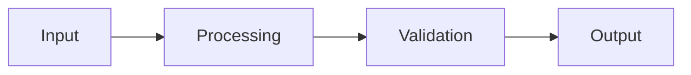

# Project Name

## Status
🚧 In Development / ✅ Completed / 🔄 Maintenance / 💡 Planning / 🚀 Released

## Overview

Brief description of the software project, its purpose, and what problem it solves.

**Repository**: [GitHub/GitLab link]  
**Documentation**: [Link to docs]  
**License**: [MIT / Apache 2.0 / GPL / Proprietary]

## Features

### Core Features
- [ ] Feature 1: Description
- [ ] Feature 2: Description
- [ ] Feature 3: Description

### Additional Features
- [ ] Feature 4: Description
- [ ] Feature 5: Description

## Tech Stack

- **Language**: Python / JavaScript / Go / Rust / Java / C++
- **Framework**: [Framework name if applicable]
- **Libraries/Dependencies**: List main libraries
- **Build Tool**: npm / cargo / maven / make
- **Testing**: pytest / jest / go test

## Installation

### Prerequisites

- [Dependency 1] version X.X+
- [Dependency 2] version Y.Y+
- Operating System requirements

### From Source

```bash
# Clone repository
git clone [repository-url]
cd project-name

# Install dependencies
npm install  # or pip install -r requirements.txt, cargo build, etc.

# Build (if needed)
npm run build  # or make, cargo build --release, etc.

# Run
npm start  # or python main.py, ./binary, etc.
```

### From Package Manager

```bash
# npm
npm install -g project-name

# pip
pip install project-name

# cargo
cargo install project-name

# homebrew
brew install project-name
```

### Using Docker

```bash
docker pull username/project-name
docker run -p 8080:8080 username/project-name
```

## Usage

### Basic Usage

```bash
# Simple command
project-name [options]

# Example
project-name --input data.txt --output result.txt
```

### Configuration

Create a configuration file:

```yaml
# config.yaml
option1: value1
option2: value2
verbose: true
```

Or use environment variables:

```bash
export PROJECT_OPTION1=value1
export PROJECT_OPTION2=value2
```

### Examples

#### Example 1: Basic Operation

```bash
project-name process --file input.txt
```

**Output:**
```
Processing input.txt...
✓ Completed successfully
Results saved to output.txt
```

#### Example 2: Advanced Usage

```python
from project_name import MainClass

# Initialize
instance = MainClass(config={'option': 'value'})

# Use
result = instance.process(data)
print(result)
```

### Command Line Interface

```bash
project-name --help

Usage: project-name [OPTIONS] COMMAND [ARGS]...

  Description of the tool

Options:
  --version              Show version and exit
  --config PATH          Configuration file path
  --verbose, -v          Verbose output
  --help                 Show this message and exit

Commands:
  init        Initialize project
  process     Process data
  export      Export results
```

## Architecture

### Project Structure

```
project-name/
├── src/                    # Source code
│   ├── main/              # Main application code
│   ├── utils/             # Utility functions
│   ├── config/            # Configuration modules
│   └── tests/             # Test files
├── docs/                  # Documentation
├── examples/              # Usage examples
├── tests/                 # Integration tests
├── scripts/               # Build/deployment scripts
├── .github/               # GitHub workflows
├── README.md
├── LICENSE
├── CHANGELOG.md
└── package.json           # or setup.py, Cargo.toml, etc.
```

### Architecture Diagram

![[architecture-diagram.excalidraw.md]]

### Key Components

1. **Component 1**: Description of its role
2. **Component 2**: Description of its role
3. **Component 3**: Description of its role

### Data Flow



## API Documentation

### Public API

#### Class: MainClass

```python
class MainClass:
    """
    Main class description
    
    Attributes:
        config (dict): Configuration dictionary
        state (str): Current state of the instance
    """
    
    def __init__(self, config=None):
        """Initialize with optional config"""
        pass
    
    def process(self, data):
        """
        Process input data
        
        Args:
            data: Input data to process
            
        Returns:
            Processed result
            
        Raises:
            ValueError: If data is invalid
        """
        pass
```

#### Function: helper_function

```python
def helper_function(param1, param2, option=None):
    """
    Helper function description
    
    Args:
        param1 (str): Description
        param2 (int): Description
        option (bool, optional): Description
        
    Returns:
        tuple: (result, status)
    """
    pass
```

## Configuration

### Configuration Options

| Option | Type | Default | Description |
|--------|------|---------|-------------|
| `verbose` | bool | false | Enable verbose output |
| `timeout` | int | 30 | Timeout in seconds |
| `max_retries` | int | 3 | Maximum retry attempts |
| `output_format` | str | "json" | Output format (json/yaml/csv) |

### Configuration File

```yaml
# config.yaml
general:
  verbose: true
  log_level: info

processing:
  timeout: 60
  max_retries: 5
  batch_size: 100

output:
  format: json
  destination: ./output/
  compress: false
```

## Development

### Setup Development Environment

```bash
# Clone repository
git clone [repository-url]
cd project-name

# Create virtual environment
python -m venv venv
source venv/bin/activate  # or venv\Scripts\activate on Windows

# Install development dependencies
pip install -r requirements-dev.txt

# Install pre-commit hooks
pre-commit install
```

### Running Tests

```bash
# Run all tests
npm test  # or pytest, cargo test, go test ./...

# Run specific test
pytest tests/test_main.py

# Run with coverage
pytest --cov=src tests/

# Run linter
npm run lint  # or pylint src/, cargo clippy
```

### Code Style

This project follows [style guide name]:
- Use [formatter] for code formatting
- Follow [naming conventions]
- Document all public APIs

```bash
# Format code
npm run format  # or black ., cargo fmt
```

## Performance

### Benchmarks

| Operation | Time | Memory |
|-----------|------|--------|
| Process 1000 items | 150ms | 45MB |
| Process 10000 items | 1.2s | 120MB |
| Large file (1GB) | 45s | 200MB |

### Optimization Notes

- Implemented caching for frequent operations
- Used parallel processing for batch operations
- Optimized memory usage with streaming

## Testing

### Test Coverage

- **Overall Coverage**: 85%
- **Core Modules**: 95%
- **Utilities**: 78%

### Test Types

1. **Unit Tests**: Test individual functions/classes
2. **Integration Tests**: Test component interactions
3. **End-to-End Tests**: Test complete workflows
4. **Performance Tests**: Benchmark critical paths

### Running Specific Tests

```bash
# Unit tests only
pytest tests/unit/

# Integration tests
pytest tests/integration/

# Specific test file
pytest tests/test_processing.py -v
```

## Deployment

### Release Process

1. Update version number
2. Update CHANGELOG.md
3. Run full test suite
4. Build release artifacts
5. Tag release in git
6. Publish to package registry

### Building for Production

```bash
# Build optimized binary
cargo build --release  # Rust
# or
npm run build  # JavaScript
# or
python setup.py sdist bdist_wheel  # Python
```

### Docker Deployment

```dockerfile
FROM python:3.9-slim

WORKDIR /app
COPY requirements.txt .
RUN pip install --no-cache-dir -r requirements.txt

COPY . .
CMD ["python", "main.py"]
```

### CI/CD Pipeline

```yaml
# .github/workflows/test.yml
name: Tests

on: [push, pull_request]

jobs:
  test:
    runs-on: ubuntu-latest
    steps:
      - uses: actions/checkout@v2
      - name: Set up environment
        run: |
          # Setup steps
      - name: Run tests
        run: |
          # Test commands
```

## Monitoring & Logging

### Logging Configuration

```python
import logging

logging.basicConfig(
    level=logging.INFO,
    format='%(asctime)s - %(name)s - %(levelname)s - %(message)s',
    handlers=[
        logging.FileHandler('app.log'),
        logging.StreamHandler()
    ]
)
```

### Metrics

- Track key performance indicators
- Monitor error rates
- Log user actions (if applicable)

## Security

### Security Considerations

- [ ] Input validation implemented
- [ ] Sanitize user inputs
- [ ] Use secure defaults
- [ ] Handle secrets properly (env vars, not hardcoded)
- [ ] Keep dependencies updated
- [ ] Follow principle of least privilege

### Vulnerability Scanning

```bash
# Python
pip-audit

# Node.js
npm audit

# Rust
cargo audit
```

## Troubleshooting

### Common Issues

#### Issue 1: Installation fails

**Problem**: Error during installation  
**Solution**: 
```bash
# Try cleaning cache
npm cache clean --force
# Then reinstall
npm install
```

#### Issue 2: Permission denied

**Problem**: Cannot execute binary  
**Solution**: 
```bash
chmod +x project-name
```

#### Issue 3: [Description]

**Problem**: 
**Solution**: 

### Debug Mode

Enable debug logging:
```bash
export DEBUG=true
project-name --verbose
```

## Challenges & Solutions

### Challenge 1: Performance Bottleneck
**Problem**: Processing large files was too slow
**Solution**: Implemented streaming and parallel processing
**Result**: 10x performance improvement

### Challenge 2: [Description]
**Problem**: 
**Solution**: 
**Result**: 

## Roadmap

### Current Version (v1.0)
- [x] Core functionality
- [x] Basic CLI
- [x] Documentation

### Version 1.1 (Planned)
- [ ] Feature A
- [ ] Feature B
- [ ] Performance improvements

### Version 2.0 (Future)
- [ ] Major feature C
- [ ] Refactor core architecture
- [ ] Plugin system

## Contributing

See [CONTRIBUTING.md](CONTRIBUTING.md) for guidelines.

### How to Contribute

1. Fork the repository
2. Create feature branch
3. Make changes
4. Add tests
5. Submit pull request

## Changelog

### [Unreleased]
- Feature additions
- Bug fixes

### [1.0.0] - YYYY-MM-DD
- Initial release
- Core features implemented

See [CHANGELOG.md](CHANGELOG.md) for full history.

## Resources

### Documentation
- [Official Documentation](link)
- [API Reference](link)
- [Tutorial](link)

### Related Projects
- [[Similar Project 1]]
- [[Similar Project 2]]

### References
- [Technology used](link)
- [Inspiration](link)

## Team

- **Author**: Your Name
- **Maintainers**: [Names]
- **Contributors**: See [CONTRIBUTORS.md](CONTRIBUTORS.md)

## License

This project is licensed under the [LICENSE_NAME] License - see [LICENSE](LICENSE) file.

## Acknowledgments

- Libraries/tools used
- Contributors
- Inspiration sources

## Support

- **Issues**: [GitHub Issues](link)
- **Discussions**: [GitHub Discussions](link)
- **Email**: contact@example.com

## Notes

Additional notes, observations, or future ideas.

---

**Created**: YYYY-MM-DD  
**Last Updated**: YYYY-MM-DD  
**Author**: Your Name
